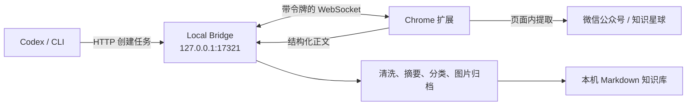

# Data Collector

Data Collector 是一个本机优先的 Chrome 扩展，用来采集微信公众号文章以及知识星球的文章、动态、问题和回答，并整理为可检索、可继续导入其他系统的 Markdown 知识库。

当前版本：`0.1.0`。默认只在本机工作，不上传账号凭证或采集内容。

## 能做什么

- 在当前页面点击扩展，一键保存微信公众号或知识星球内容。
- 从 Codex/终端提交 URL，让扩展打开后台标签页并自动采集。
- 提取标题、作者、发布时间、正文与最多 30 张图片。
- 离线生成摘要、分类和标签；用户指定的分类/标签优先。
- 原子写入本地 Markdown，重复采集同一规范 URL 时更新原条目，不制造副本。
- 遇到知识星球未登录、页面结构不支持等情况时明确提示人工处理。

## 架构



扩展负责读取已登录浏览器中可见的页面；Bridge 负责任务、整理和文件写入。这样既能利用浏览器会话，也不需要把 Cookie 交给服务端。

## 环境要求

- macOS、Linux 或 Windows
- Node.js 22.12 或更高版本
- Chrome 116 或更高版本
- npm 9 或更高版本

先确认没有误用系统旧版 Node：

```bash
node --version
npm --version
```

## 安装和首次配对

```bash
cd ~/Code/data-collector
npm install
npm run build
npm run package
```

1. 打开 `chrome://extensions`，启用“开发者模式”。
2. 点击“加载已解压的扩展程序”，选择绝对路径 `~/Code/data-collector/packages/extension/dist`。
3. 在一个终端中保持 Bridge 运行：

   ```bash
   cd ~/Code/data-collector
   npm run collector -- bridge start
   ```

4. 点击 Chrome 工具栏中的 Data Collector，输入终端显示的 6 位配对码。配对码有效期 10 分钟且只能使用一次。

默认知识库位于 `~/Documents/data-collector`，认证配置位于 `~/.data-collector/auth.json`。可通过参数或环境变量更改：

```bash
npm run collector -- bridge start -- --library ~/Knowledge/data-collector --config ~/.data-collector
# 或 DATA_COLLECTOR_LIBRARY、DATA_COLLECTOR_CONFIG、DATA_COLLECTOR_PORT
```

## 使用

### 保存当前页面

打开一篇支持的内容，点击扩展，再点击“保存当前页面”。知识星球内容必须先在浏览器内登录，并打开单条内容详情页。

### 从 Codex 或终端采集 URL

Bridge 和扩展在线时，执行：

```bash
cd ~/Code/data-collector
npm run collector -- collect 'https://mp.weixin.qq.com/s/...' --wait 60000
```

成功时标准输出只返回 Markdown 文件的绝对路径，便于 Codex 接收后继续读取、归纳或导入其他系统。Codex 可以直接运行同一命令，因此不需要额外云端账号。

检查连接：

```bash
npm run collector -- health
```

## 输出结构

```text
~/Documents/data-collector/
├── 微信公众号/<分类>/<年份>/<稳定ID-标题>/index.md
├── 知识星球/<分类>/<年份>/<稳定ID-标题>/index.md
├── .../assets/<内容哈希>.<扩展名>
└── _catalog/
    ├── index.json
    └── jobs.json
```

每篇 Markdown 包含可追溯的 URL、作者、时间、摘要、分类、标签、图片失败数和清洗后的正文。详情参见 [产品方案](docs/product.md)、[协议说明](docs/protocol.md)、[测试手册](docs/testing.md) 与 [安全说明](SECURITY.md)。

## 常用开发命令

```bash
npm run typecheck
npm test
npm run test:e2e
npm run test:coverage
npm run package
```

## 故障排查

- **扩展显示“未配对”**：确认 Bridge 正在运行，重新生成配对码；旧码不可复用。
- **Codex/CLI 超时**：确认扩展图标显示“本机在线”，Chrome 未退出，并用 `npm run collector -- health` 检查连接。
- **知识星球要求登录**：在同一 Chrome 配置中登录，打开具体文章、动态或问答详情页后重试。
- **页面结构不支持**：保留页面 URL 和截图；站点 DOM 变化后需要更新提取器，不会退化为抓取整页杂讯。
- **图片未下载**：正文仍会保存并保留远程图片地址，`failed_images` 记录失败数量。

## 版本边界

`~/Code/midway/fe-journey-faas` 是当前机器上实际存在的服务端仓库（请求中给出的 `~/Code/fe-journey-faas` 不存在）。0.1.0 没有修改该服务：云端 FaaS 无法直接写本机目录，并且转发知识星球私有内容会扩大隐私边界。Bridge 已把“保存目标”隔离为明确边界，后续可增加经过授权的 FaaS/产品 API sink。

## 许可

[MIT](LICENSE)
