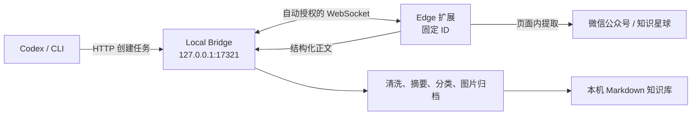

# Data Collector

Data Collector 是一个本机优先的 Microsoft Edge 扩展。它常驻 Side Panel，把微信公众号文章、知识星球的文章/动态/问答，以及牛客网的面经/讨论整理为结构化内容；默认写入本机 Markdown 知识库，也可按来源路由投递到目标仓库的收件箱，供 Claude Code / Codex 等 Agent 后续归档。正文和账号凭证默认不会上传云端。

## 能做什么

- 在受支持页面点击工具栏图标，一步打开 Side Panel，再点击“保存这一页”。
- 首次连接由固定扩展身份自动授权，不需要输入任何连接信息。
- 从 Codex 或终端提交 URL，让扩展打开后台标签页并自动采集。
- 提取标题、作者、发布时间、正文与最多 30 张图片。
- 离线生成摘要、分类和标签；用户指定的分类、标签优先。
- 原子写入 Markdown；重复采集同一规范 URL 时更新原条目，不制造副本。
- 按来源自动投递到目标仓库收件箱（公众号/星球 → life-teachers，牛客 → fe-journey），供 Agent 后续归档。**零配置**：仓库在本机存在就自动启用，详见 [落地目标与来源路由](docs/sinks.md)。
- 遇到知识星球未登录、页面结构不支持等情况时明确要求人工处理。

## 架构与信任边界



扩展复用浏览器中已有的登录会话，但不会读取或保存 Cookie。Bridge 只监听回环地址。WebSocket Origin 校验会拒绝普通网页和其他扩展；自动授权信任发布包中的固定扩展身份。固定公钥和扩展 ID 不是秘密，这套设计不防御已经以同一用户身份控制本机的恶意进程，详情见 [安全说明](SECURITY.md)。

## 环境要求

- macOS、Linux 或 Windows
- Node.js 22.12 或更高版本
- Microsoft Edge 116 或更高版本
- npm 9 或更高版本

先确认没有误用系统旧版 Node：

```bash
node --version
npm --version
```

## 构建与安装

```bash
cd ~/Code/data-collector
npm install
npm run package
```

打包命令会从构建后的 manifest 读取版本，并生成：

- 稳定的已解压安装目录：`artifacts/data-collector-extension`
- 可复现发布包：`artifacts/data-collector-extension-<版本>.zip`

安装步骤：

1. 打开 `edge://extensions`，启用“开发人员模式”。
2. 点击“加载解压缩的扩展”，选择绝对路径 `~/Code/data-collector/artifacts/data-collector-extension`。
3. 装好本机服务（**只做一次**）：

   ```bash
   cd ~/Code/data-collector
   npm run setup
   ```

   这条命令会构建、把本机服务装成登录项（macOS 用 LaunchAgent，Linux 用 systemd user 服务）、
   立刻启动并等它就绪。之后每次开机自动运行，进程意外退出也会自动拉起 —— 不需要再手动
   `bridge start`，也不用留着一个终端窗口。

4. 在受支持的文章页点击工具栏中的 Data Collector。Edge 会打开 Side Panel，扩展将以固定身份自动连接本机 Bridge。

**自更新**：常驻的本机服务每 10 分钟检查一次远端，有新提交就**快进拉取并重新构建**，
然后侧栏顶部出现「本机服务已拉取并构建了新版本 / 立即加载」——点一下就生效，
不用开终端、也不用去 `edge://extensions`。

三条硬约束：只快进（分叉了宁可不动）、**本地有未提交改动就完全跳过**（不覆盖你正在改的东西）、
更新失败绝不影响采集。想关掉就用 `bridge start --no-update`。

服务相关的其余命令：

```bash
npm run collector -- bridge status      # 看服务在不在
npm run collector -- bridge update      # 立刻拉一次并重新构建
npm run collector -- bridge uninstall   # 取消开机自动运行
npm run collector -- bridge start       # 前台临时跑一次（调试用）
```

默认知识库位于 `~/Documents/data-collector`，认证配置位于 `~/.data-collector/auth.json`，
服务日志在 `~/.data-collector/bridge.log`。可通过环境变量更改：
`DATA_COLLECTOR_LIBRARY`、`DATA_COLLECTOR_CONFIG`、`DATA_COLLECTOR_PORT`。

### 从旧版迁移

0.2.0 使用固定 manifest 公钥，因此重新加载旧的已解压目录不能把旧扩展 ID 变成新 ID。请完整执行：

1. 在 `edge://extensions` 找到旧的 Data Collector 并点击“删除”。
2. 运行 `npm run package`，确认新的 0.2.0 ZIP 和稳定安装目录都已生成。
3. 选择 `artifacts/data-collector-extension` 重新“加载解压缩的扩展”。
4. 运行 `npm run setup` 装好本机服务，打开受支持页面并点击扩展图标；Side Panel 应自动显示“本机在线”。

不要同时保留旧 ID 和 0.2.0；Bridge 只信任正式固定 ID。若仍显示“扩展身份异常”，再次确认旧扩展已删除、安装目录来自最新打包结果，然后重新安装。

## 使用

### 保存当前页面

打开一篇支持的内容，点击 Data Collector 工具栏图标打开 Side Panel，再点击“保存这一页”。Side Panel 可以保持打开并持续显示采集进度。知识星球内容必须先在同一 Edge 配置中登录。

采集前会自动点开正文里的“展开全文”，折叠的长帖也能采到完整正文。

### 批量保存知识星球列表页

在知识星球的分组页、分类页或“精华”页（地址里没有 `/topic/`），Side Panel 的按钮会变成“批量保存本页帖子”，把整屏帖子逐条拆开入库：

- **问答帖的问与答都会归档**（回答往往才是重点）；页面上它们是两个独立的块，
  对号时也会一块块单独试 —— 只拿拼接后的整段去比是对不上的（中间夹着「回答」这类标签）；
- 每条帖子按各自的 `/topic/<帖子号>` 地址建独立条目，不会相互覆盖。帖子号不在页面 DOM 上
  （站点把它留在组件状态里），扩展通过**旁观页面自己发出的接口响应**取回它，再按正文对号；
  只取帖子号和用于对号的正文，不额外发请求、不读 Cookie、不碰凭证；
- **本次采集条数**可以自己填（默认 20，上限 60）：采够就自动停，不需要盯着手动停；
  处理过的帖子只打一个**不可见**的标记，**页面外观一动不动**——你要能肉眼核对采到的内容；
- 扩展安装 / 更新后，之前就打开着的标签页会被**自动补上两个脚本**（内容脚本 + 主世界帖子号钩子），
  **不刷新页面**——刷新会把「精华」退回「最新」，采到的就不是你要的内容。补钩子之前那次接口
  响应已经错过，所以老标签页首屏的帖子号取不回来：把分类切走再切回来即可重新请求（仍留在精华页）；
- 「继续采下一批」会先滚动把下一页加载出来再提取；
- 对不上号的帖子如实计入“已跳过”，绝不猜一个地址（猜错会把两条内容写到同一个文件上）。
  对号用的是正文：接口里的话题标签 / @提及 / 外链是内联标记，会先还原成页面上显示的样子再比；
  开头对不上时还允许「整段包含」（折叠、正文从中段渲染都属此类），但**不容忍任何一个字的差异**，
  也不接受一份证据同时指向多条——宁可漏，不可错；
  如果一条都没对上，面板会区分“还没截到接口响应”（滚动一屏或切一次分类即可）和
  “截到了但对不上”（需要修适配）；
- 面板实时显示“已入库 / 已跳过 / 失败”，跑的过程中可以随时“停止”；
- 结束时区分“完成 / 到顶 / 已停止 / 没找到帖子 / 全部无法定位 / 中断”，**零产出和中断不会显示成完成**，并给出对应的下一步按钮；
- **「查看本轮明细」**：逐条列出标题与状态（已入库 / 已跳过 / 失败，跳过和失败带原因），
  顶部按状态筛选，点某一条页面就滚到它那儿并加边框高亮，方便逐条核对；还能复制整轮运行记录。
  **点未入库的条目还会把「为什么没成」的证据复制到剪贴板**：构建版本、页面上有多少条 /
  截到多少个帖子号、这条的页面文本、以及最像的几条接口记录（保留接口原文，能看出内联标记）
  和最长共同片段长度。对不上号时把它贴出来即可定位，不必来回猜。

侧栏的完整状态机、优先级规则和错误场景矩阵见 [`docs/sidepanel-states.md`](docs/sidepanel-states.md)，改交互前先改那份文档。

### 保存去向：默认是「两处都写」

侧栏「去向」里 `默认：本机库 + life-teachers 收件箱` 表示一篇内容**同时写两处**——
本机 Markdown 库留底，外加目标仓库的 `_inbox/` 条目（自动 `git commit` 到当前分支，**默认不 push**）。
选具体去向（`只存到 …`）是**覆盖**默认路由而非追加：只写那一处，不再留本机备份，
侧栏会把放弃掉的去向写在提示里。保存成功后的结果屏会如实列出这一篇到底进了哪几处。
完整说明见 [落地目标与来源路由](docs/sinks.md)。

### 已入库内容管理

侧栏顶部有「采集 / 已入库」两个页面。「已入库」列出本机知识库里的全部条目，可按来源筛选，
**点任意一条就地打开正文浮层**（Markdown 原文 + 来源 / 分类 / 文件路径，可直接跳原文或打开所在文件夹）。
支持删除单条与一键清空。**删除不可逆**，因此一律先进入确认态、写清楚要删什么，再执行；
删条目会连同它的目录（正文 + assets）一起删并同步索引，绝不留下指向空目录的僵尸记录。

### 选题过滤

用户明确不看的类别在采集端就跳过，目前内置**打新（新股申购）**、**楼市**、**相亲情感**。
判据一律是「强信号 + 至少两个不同信号」，避免误伤：顺口提到「破发」的投资分析、
主线讲资产配置只是提了句房贷的帖子、「选股就像相亲」这类比喻，都会照常收录。
被跳过的条目**照样出现在「本轮明细」里**，状态是已跳过、原因写明类别 —— 绝不静默丢弃，
你随时能看到自己漏掉了什么。规则在 `packages/extension/src/topicFilter.ts`。

### 拟人化节奏

批量采集会像人一样翻页：每次滚动不到一屏、分几次滚、间隔随机（450–1100ms），
每轮之间还有 0.9–1.8 秒停顿，条与条入库之间也留随机间隔，避免连续无间隔的请求触发风控。

### 从 Codex 或终端采集 URL

Bridge 和扩展在线时执行：

```bash
cd ~/Code/data-collector
npm run collector -- collect 'https://mp.weixin.qq.com/s/...' --wait 60000
```

成功时标准输出只返回 Markdown 文件的绝对路径。检查连接：

```bash
npm run collector -- health
```

## 输出结构

```text
~/Documents/data-collector/
├── 微信公众号/<分类>/<年份>/<稳定ID-标题>/index.md
├── 知识星球/<分类>/<年份>/<稳定ID-标题>/index.md
├── .../assets/<内容哈希>.<扩展名>
└── _catalog/
    ├── index.json
    └── jobs.json
```

每篇 Markdown 包含可追溯 URL、作者、时间、摘要、分类、标签、图片失败数和清洗后的正文。详情参见 [产品方案](docs/product.md)、[协议说明](docs/protocol.md)、[测试手册](docs/testing.md) 与 [安全说明](SECURITY.md)。

## 怎么确认自己装的是最新版

侧栏**右下角**常驻 `v<版本> · <短 sha>`，例如 `v0.2.1 · 14c6cfa`。
它是打包时烙进产物的，和 `git log --oneline -1` 的短 sha 逐字对得上；
本地有未提交改动时会显示 `<sha>+本地改动`。

对不上就说明浏览器里加载的还是旧构建，重新执行：

```bash
cd ~/code/data-collector
git pull origin master
npm run package          # 刷新 Edge 实际加载的 artifacts/data-collector-extension
```

然后在 `edge://extensions` 点一次 Data Collector 的「重新加载」。

> `npm run setup` 只负责构建并把**本机服务**装成登录项，**不会**刷新 Edge 加载的解压目录——
> 要更新扩展本体必须跑 `npm run package`。

## 常用开发命令

```bash
npm run typecheck
npm test
npm run test:e2e
npm run test:coverage
npm run package
```

## 故障排查

- **Side Panel 显示“服务离线”**：先跑 `npm run collector -- bridge status` 确认服务是否在跑。没在跑就执行一次 `npm run setup`（它会构建 + 装登录项 + 启动 + 等就绪），再点“重新连接”。注意 `dist/` 不进版本库，`git pull` 之后没构建过时 `npm run collector` 会直接报找不到模块——`npm run setup` 已经包含构建。
- **Side Panel 显示“扩展身份异常”**：按旧版迁移步骤删除旧 ID，并从最新稳定安装目录重新安装。
- **Side Panel 显示“另一个浏览器实例已接管”**：另一个 Chrome/Edge 实例正在使用 Bridge；关闭另一实例，或点击“在此实例重新连接”主动接管。旧实例不会自动反复重连。
- **Codex/CLI 超时**：确认 Side Panel 显示“本机在线”、Edge 未退出，并运行 `npm run collector -- health`。
- **知识星球要求登录**：在同一 Edge 配置中登录，打开具体文章、动态或问答详情页后重试。
- **页面结构不支持**：保留页面 URL 和脱敏截图；站点 DOM 变化后应更新专用提取器。
- **图片未下载**：正文仍会保存并保留远程图片地址，`failed_images` 记录失败数量。

## 版本边界

0.2.0 不修改 `~/Code/midway/fe-journey-faas`。云端服务无法直接写本机目录，转发知识星球私有内容也会扩大隐私边界；后续云端 sink 必须是用户可见、可撤销且独立授权的保存目标。

## 许可

[MIT](LICENSE)
