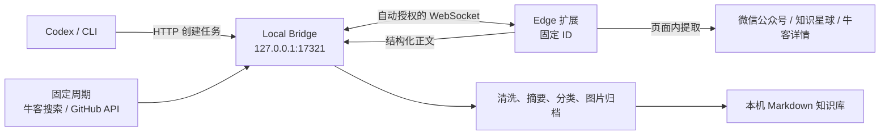

# Data Collector

Data Collector 是一个本机优先的 Microsoft Edge 扩展与 Bridge。它把微信公众号文章、知识星球内容和牛客讨论整理为结构化内容，也按固定个人预设定时发现 Agent 全栈研发相关的牛客内容与 GitHub 项目候选。内容先进入本机 Markdown 库，再由 Codex 从本地收件箱加工；正文和账号凭证默认不会上传云端。

## 能做什么

- 在受支持页面点击工具栏图标，一步打开 Side Panel，再点击“保存这一页”。
- 首次连接由固定扩展身份自动授权，不需要输入任何连接信息。
- 从 Codex 或终端提交 URL，让扩展打开后台标签页并自动采集。
- 按写死的个人预设定时发现牛客面经/知识/运营素材和 GitHub 优秀项目候选；不提供订阅或关键词设置页。
- 对候选内容确定性评分、跨 URL 去重和近似聚类；项目只形成评分候选，不涉及会员权益或产品发布。
- 提取标题、作者、发布时间、正文与最多 30 张图片。
- 离线生成摘要、分类和标签；用户指定的分类、标签优先。
- 原子写入 Markdown；重复采集同一规范 URL 时更新原条目，不制造副本。
- 采集**只落本机库**；核对后再显式同步到目标仓库收件箱（公众号/星球 → life-teachers，牛客/GitHub → fe-journey）。**零配置**：仓库在本机存在就自动启用，详见 [落地目标与来源路由](docs/sinks.md)。
- 遇到知识星球未登录、页面结构不支持等情况时明确要求人工处理。

## 架构与信任边界



扩展复用浏览器中已有的登录会话，但不会读取或保存 Cookie。Bridge 只监听回环地址。WebSocket Origin 校验会拒绝普通网页和其他扩展；自动授权信任发布包中的固定扩展身份。固定公钥和扩展 ID 不是秘密，这套设计不防御已经以同一用户身份控制本机的恶意进程，详情见 [安全说明](SECURITY.md)。

## 环境要求

- macOS、Linux 或 Windows
- Node.js 22.12 或更高版本
- Microsoft Edge 116 或更高版本
- npm 9 或更高版本

先确认没有误用系统旧版 Node：

```bash
node --version
npm --version
```

## 构建与安装

```bash
cd ~/Code/data-collector
npm install
npm run package
```

打包命令会从构建后的 manifest 读取版本，并生成：

- 稳定的已解压安装目录：`artifacts/data-collector-extension`
- 可复现发布包：`artifacts/data-collector-extension-<版本>.zip`

安装步骤：

1. 打开 `edge://extensions`，启用“开发人员模式”。
2. 点击“加载解压缩的扩展”，选择绝对路径 `~/Code/data-collector/artifacts/data-collector-extension`。
3. 装好本机服务（**只做一次**）：

   ```bash
   cd ~/Code/data-collector
   npm run setup
   ```

   这条命令会构建、把本机服务装成登录项（macOS 用 LaunchAgent，Linux 用 systemd user 服务）、
   立刻启动并等它就绪。之后每次开机自动运行，进程意外退出也会自动拉起 —— 不需要再手动
   `bridge start`，也不用留着一个终端窗口。

4. 在受支持的文章页点击工具栏中的 Data Collector。Edge 会打开 Side Panel，扩展将以固定身份自动连接本机 Bridge。

**自更新（正常情况下你什么都不用做）**：常驻的本机服务每 10 分钟检查一次远端，
有新提交就**快进拉取并重新构建**；**磁盘上的产物落后于代码时也会重新构建**——
上一轮构建失败过、或者你自己 `git pull` 了没构建，都属于这种，只看「HEAD 动没动」
会一直答「已是最新」，而产物其实一直是旧的。

产物一新，扩展就**自己重新加载**，不用去 `edge://extensions`，也不用点任何按钮。
只有两种情况它不自作主张：

- **正在采集**：重启会把跑到一半的批次断在那儿，而页面上的已处理标记还在，重来会整批跳过。
- **同一个版本自动重载过一次还是没变**：说明浏览器里加载的不是
  `artifacts/data-collector-extension` 这个目录，横幅会直说——再点多少次都没用。

侧栏开着不会阻止更新；任务空闲后照样自动重载。侧栏顶部的“立即加载”保留作手动兜底。

判断依据是产物里的构建标记（`build-id.txt`，也就是侧栏右下角那行 `v<版本> · <短 sha>`），
不是 git HEAD。构建失败时横幅会把服务报的原因原样说出来，而不是让你对着一个点了也没用的
按钮干等。

**本机服务自己也会重启**：拉下来的服务端代码只有换一次进程才作数（进程跑的是内存里那份旧的）。
它会等到**没有扩展连着、也没有任务在跑**的时候才退出，登录项（launchd `KeepAlive` /
systemd `Restart=always`）立刻把它拉起来——采集途中绝不打断，浏览器一关就是安全窗口。

三条硬约束：只快进（分叉了宁可不动；本地领先远端时保留本地提交且不重复构建）、
**本地有未提交改动就完全跳过**（不覆盖你正在改的东西）、更新失败绝不影响采集。
想关掉就用 `bridge start --no-update`。

服务里跑 `git` / `npm` 一律先探到绝对路径再用：登录项拿到的 PATH 比你终端里的窄
（launchd 只给 `/usr/bin:/bin:/usr/sbin:/sbin`），裸名字解析不到的话，自更新会一声不响地
不工作，只往服务日志写一行 warn。

服务相关的其余命令：

```bash
npm run collector -- bridge status      # 看服务在不在
npm run collector -- bridge update      # 立刻拉一次并重新构建
npm run collector -- bridge uninstall   # 取消开机自动运行
npm run collector -- bridge start       # 前台临时跑一次（调试用）
```

默认知识库位于 `~/Documents/data-collector`，认证配置位于 `~/.data-collector/auth.json`，
服务日志在 `~/.data-collector/bridge.log`。可通过环境变量更改：
`DATA_COLLECTOR_LIBRARY`、`DATA_COLLECTOR_CONFIG`、`DATA_COLLECTOR_PORT`。

### 从旧版迁移

0.2.0 使用固定 manifest 公钥，因此重新加载旧的已解压目录不能把旧扩展 ID 变成新 ID。请完整执行：

1. 在 `edge://extensions` 找到旧的 Data Collector 并点击“删除”。
2. 运行 `npm run package`，确认新的 0.2.0 ZIP 和稳定安装目录都已生成。
3. 选择 `artifacts/data-collector-extension` 重新“加载解压缩的扩展”。
4. 运行 `npm run setup` 装好本机服务，打开受支持页面并点击扩展图标；Side Panel 应自动显示“本机在线”。

不要同时保留旧 ID 和 0.2.0；Bridge 只信任正式固定 ID。若仍显示“扩展身份异常”，再次确认旧扩展已删除、安装目录来自最新打包结果，然后重新安装。

## 使用

### 保存当前页面

打开一篇支持的内容，点击 Data Collector 工具栏图标打开 Side Panel，再点击“保存这一页”。Side Panel 可以保持打开并持续显示采集进度。知识星球内容必须先在同一 Edge 配置中登录。

采集前会自动点开正文里的“展开全文”，折叠的长帖也能采到完整正文。

### 批量保存知识星球列表页

在知识星球的分组页、分类页或“精华”页（地址里没有 `/topic/`），Side Panel 的按钮会变成“批量保存本页帖子”，把整屏帖子逐条拆开入库：

- **问答帖的问与答都会归档**（回答往往才是重点）；页面上它们是两个独立的块，
  对号时也会一块块单独试 —— 只拿拼接后的整段去比是对不上的（中间夹着「回答」这类标签）；
- 每条帖子按各自的 `/topic/<帖子号>` 地址建独立条目，不会相互覆盖。帖子号不在页面 DOM 上
  （站点把它留在组件状态里），扩展通过**旁观页面自己发出的接口响应**取回它，再按正文对号；
  只取帖子号、正文组件和正文资源清单，不额外发请求、不读 Cookie、不碰凭证。超大数字帖子号
  从原始 JSON 保留，不会被 JavaScript number 舍入；问答缺一半、未知媒体组件、图片/附件占位符
  对不上清单，或同一帖子号出现冲突版本时，都会保持“正文不完整”并重试，绝不猜着入库；
- **本次采集条数**可以自己填（默认 20，上限 60）：采够就自动停，不需要盯着手动停；
  处理过的帖子只打一个**不可见**的标记，**页面外观一动不动**——你要能肉眼核对采到的内容；
- 扩展安装 / 更新后，之前就打开着的标签页会被**自动补上两个脚本**（内容脚本 + 主世界帖子号钩子），
  **不刷新页面**——刷新会把「精华」退回「最新」，采到的就不是你要的内容。补钩子之前那次接口
  响应已经错过，所以老标签页首屏的帖子号取不回来：把分类切走再切回来即可重新请求（仍留在精华页）；
- 「继续采下一批」会先滚动把下一页加载出来再提取；
- 对不上号的帖子如实计入“已跳过”，绝不猜一个地址（猜错会把两条内容写到同一个文件上）。
  对号用的是正文：接口里的话题标签 / @提及 / 外链是内联标记，会先还原成页面上显示的样子再比；
  身份只接受归一化后的正文完全相等，或页面明确带「展开全部 / 展开全文 / 阅读全文」
  控件时的同起点折叠前缀。普通包含、引用或转发不算证据；一份证据同时指向多条也不接受——
  宁可漏，不可错；
  纯图片/附件帖也支持精确对号；页面用 large/thumbnail 地址时会匹配同一图片的来源别名，归档仍
  统一保存 original 原图。列表与详情的资源集合不一致且接口不能证明哪份正确时，整条继续重试；
  一个帖子号都没截到时，插件会**先自己切走分类再切回来**，让站点重新请求一次
  （不刷新页面——刷新会把「精华」退回「最新」），然后重跑这一轮；
  仍然不行才报错，且面板会**说清是哪一种**：钩子没在运行（新开标签页）、钩子在跑但页面
  这段时间没发请求（切一次分类）、还是接口里确实没有帖子号（需要修适配）——
  主世界钩子会上报旁观到多少请求、多少 JSON 响应、多少含帖子号，据此判定，不再靠猜；
- 面板实时显示“已入库 / 已跳过 / 失败”，跑的过程中可以随时“停止”；
- 结束时区分“完成 / 到顶 / 已停止 / 没找到帖子 / 全部无法定位 / 中断”，**零产出和中断不会显示成完成**，并给出对应的下一步按钮；
- **「查看本轮明细」**：逐条列出标题与状态（已入库 / 已跳过 / 失败，跳过和失败带原因），
  顶部按状态筛选，点某一条页面就滚到它那儿并加边框高亮，方便逐条核对；还能复制整轮运行记录。
  **点未入库的条目还会把「为什么没成」的证据复制到剪贴板**：构建版本、页面上有多少条 /
  截到多少个帖子号、这条的页面文本、以及最像的几条接口记录（保留接口原文，能看出内联标记）
  和最长共同片段长度。对不上号时把它贴出来即可定位，不必来回猜。

侧栏的完整状态机、优先级规则和错误场景矩阵见 [`docs/sidepanel-states.md`](docs/sidepanel-states.md)，改交互前先改那份文档。

### 采集 → 本地 → 同步 → 归档

整个工具按这四步走，**采集只落本地，投递到仓库是之后的显式动作**：

| 步骤 | 发生什么 |
|---|---|
| **1. 采集** | 内容写进 `~/Documents/data-collector/…`。本机库是**唯一落点**，也是去重与「已入库」列表的**唯一依据**。条目状态记为「未同步」。 |
| **2. 核对** | 侧栏「已入库」：按来源 / 同步状态筛选，点开看正文，删掉不要的。 |
| **3. 同步** | 逐条「同步这一条」，或一键「同步未同步的 N 条」→ 写进 `<repo>/_inbox/…` + `git commit` + 尝试 `push`。 |
| **4. 归档** | 你自己在 Agent 里拉收件箱，按各仓库的 `CLAUDE.md` 归档。 |

为什么不在采集时直接投递：那样就失去了中间那道核对，出问题也分不清是采错了还是投错了。

几条硬约束：一条同步失败不影响同批其余；需要远端交付的目标中，**推送失败就算同步失败**；
fe-journey 候选收件箱显式配置为纯本地、不提交也不推送。重新采集同一地址仍只有一条，但同步状态
**回到未同步**（内容可能变了，该重新过一遍）。完整说明见 [落地目标与来源路由](docs/sinks.md)。

### 已入库内容管理

侧栏顶部有「采集 / 已入库」两个页面。「已入库」列出本机知识库里的全部条目，
可按**来源**与**同步状态**（未同步 / 已同步 / 同步失败）筛选，
**点任意一条就地打开正文浮层**（Markdown 原文 + 来源 / 分类 / 同步状态 / 文件路径，
可直接跳原文、打开所在文件夹，或就地同步这一条）。
支持删除单条与一键清空。**删除不可逆**，因此一律先进入确认态、写清楚要删什么，再执行；
删条目会连同它的目录（正文 + assets）一起删并同步索引，绝不留下指向空目录的僵尸记录。

### 选题过滤

用户明确不看的类别在采集端就跳过，目前内置**打新（新股申购）**、**楼市**、**相亲情感**。
判据一律是「强信号 + 至少两个不同信号」，避免误伤：顺口提到「破发」的投资分析、
主线讲资产配置只是提了句房贷的帖子、「选股就像相亲」这类比喻，都会照常收录。
被跳过的条目**照样出现在「本轮明细」里**，状态是已跳过、原因写明类别 —— 绝不静默丢弃，
你随时能看到自己漏掉了什么。规则在 `packages/extension/src/topicFilter.ts`。

### 拟人化节奏

批量采集会像人一样翻页：每次滚动不到一屏、分几次滚、间隔随机（450–1100ms），
每轮之间还有 0.9–1.8 秒停顿，条与条入库之间也留随机间隔，避免连续无间隔的请求触发风控。

### 从 Codex 或终端采集 URL

Bridge 和扩展在线时执行：

```bash
cd ~/Code/data-collector
npm run collector -- collect 'https://mp.weixin.qq.com/s/...' --wait 60000
```

成功时标准输出只返回 Markdown 文件的绝对路径。检查连接：

```bash
npm run collector -- health
```

### fe-journey 固定候选采集

常驻 Bridge 会自动检查周期；也可以手动触发或查看状态：

```bash
npm run collector -- fe-journey collect --force
npm run collector -- fe-journey status
```

固定预设是牛客每日一次（最多 24 个详情任务）、GitHub 每 7 日一次（最多 12 个项目）。牛客公开搜索页只负责发现 URL，详情正文仍由 Edge 扩展使用现有浏览器会话采集；GitHub 公共仓库由 Bridge 读取 API 与 README。采集阶段不会启动 Claude Code CLI：Agent 只在之后读取本机 `front-end-journey-resource/_inbox`，按资源仓库中的 Codex skill 聚合并更新内容。详见 [fe-journey 采集与消费](docs/fe-journey-collection.md)。

### 从 Codex 端到端交付

仓库内置并通过 `npm run setup` 安装 `data-collector-delivery` Skill。对 Codex 说下面两句话即可走完整交付，而不是只停在本机采集：

- `触发知识星球内容收集`：运行陈老师的 15 天固定计划，只处理本批次星主内容，归档到 `life-teachers` 并推送。
- `更新牛客产品内容`：采集腾讯、字节、阿里、蚂蚁的近期 Agent 研发面经，只消费本批次 A/B 证据，更新面经与知识点，推送后等待 `sync-content` 成功上线。

两个流程都会返回可等待的批次 JSON，并用 `batchId` 精确圈定收件箱。登录缺失、正文截断、验证失败、推送或发布失败时会保留原始证据并停止，不会把失败说成完成。运营内容目前只形成私有候选，不自动发布小红书。

资源边界是固定的：自动采集标签页并发为 1，最多临时增加 1 个关联文章页；正常终态自动页为 0，只有登录授权页可以交给用户。任务记录只保留全部未终态/待处理项和最近 1,000 个终态，固定计划只保留全部运行中批次和最近 180 个终态；正文、去重状态和仓库收件箱不受此清理影响。

## 输出结构

```text
~/Documents/data-collector/
├── 微信公众号/<分类>/<年份>/<稳定ID-标题>/index.md
├── 知识星球/<分类>/<年份>/<稳定ID-标题>/index.md
├── .../assets/<内容哈希>.<扩展名>
└── _catalog/
    ├── index.json
    ├── fe-journey.json
    └── jobs.json
```

每篇 Markdown 包含可追溯 URL、作者、时间、摘要、分类、标签、图片失败数和清洗后的正文。详情参见 [产品方案](docs/product.md)、[协议说明](docs/protocol.md)、[测试手册](docs/testing.md) 与 [安全说明](SECURITY.md)。

## 怎么确认自己装的是最新版

侧栏**右下角**常驻 `v<版本> · <短 sha>`，例如 `v0.2.1 · 14c6cfa`。
它是打包时烙进产物的，和 `git log --oneline -1` 的短 sha 逐字对得上；
本地有未提交改动时会显示 `<sha>+dirty.<内容指纹>`。指纹由 tracked diff
和未跟踪文件的路径、内容生成；相同内容稳定，内容变了就会产生新标记，
而 `.gitignore` 中的依赖、缓存和 `artifacts/` 不参与计算。

对不上就说明浏览器里加载的还是旧构建。正常情况下常驻服务会自动拉取、打包并通知扩展自行重载；需要立即排查时可执行：

```bash
cd ~/code/data-collector
git pull origin master
npm run package          # 刷新 Edge 实际加载的 artifacts/data-collector-extension
```

没有采集任务时会自动重载，即使侧栏开着也不需要手动操作；“立即加载”是兜底入口。只有确认浏览器加载目录不是稳定目录时，才需要去 `edge://extensions` 重新选择 `artifacts/data-collector-extension`。

> `npm run setup` 负责构建和安装本机服务；`npm run package` 负责刷新 Edge 加载的稳定目录。自动更新器会依次完成这两类更新。

## 常用开发命令

```bash
npm run typecheck
npm test
npm run test:e2e
npm run smoke:fe-journey
npm run smoke:delivery
npm run test:coverage
npm run package
```

## 故障排查

- **Side Panel 显示“服务离线”**：先跑 `npm run collector -- bridge status` 确认服务是否在跑。没在跑就执行一次 `npm run setup`（它会构建 + 装登录项 + 启动 + 等就绪），再点“重新连接”。注意 `dist/` 不进版本库，`git pull` 之后没构建过时 `npm run collector` 会直接报找不到模块——`npm run setup` 已经包含构建。
- **Side Panel 显示“扩展身份异常”**：按旧版迁移步骤删除旧 ID，并从最新稳定安装目录重新安装。
- **Side Panel 显示“另一个浏览器实例已接管”**：另一个 Chrome/Edge 实例正在使用 Bridge；关闭另一实例，或点击“在此实例重新连接”主动接管。旧实例不会自动反复重连。
- **Codex/CLI 超时**：确认 Side Panel 显示“本机在线”、Edge 未退出，并运行 `npm run collector -- health`。
- **知识星球要求登录**：在同一 Edge 配置中登录，打开具体文章、动态或问答详情页后重试。
- **页面结构不支持**：保留页面 URL 和脱敏截图；站点 DOM 变化后应更新专用提取器。
- **图片未下载**：正文仍会保存并保留远程图片地址，`failed_images` 记录失败数量。

## 版本边界

0.2.0 不修改 `~/Code/midway/fe-journey-faas`。云端服务无法直接写本机目录，转发知识星球私有内容也会扩大隐私边界；后续云端 sink 必须是用户可见、可撤销且独立授权的保存目标。

## 许可

[MIT](LICENSE)
