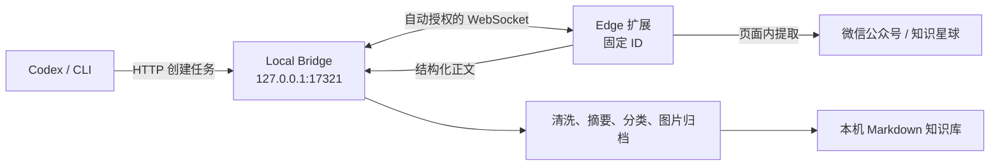

# Data Collector

Data Collector 0.2.0 是一个本机优先的 Microsoft Edge 扩展。它常驻 Side Panel，把微信公众号文章以及知识星球的文章、动态、问题和回答整理为本机 Markdown 知识库。正文和账号凭证默认不会上传云端。

## 能做什么

- 在受支持页面点击工具栏图标，一步打开 Side Panel，再点击“保存这一页”。
- 首次连接由固定扩展身份自动授权，不需要输入任何连接信息。
- 从 Codex 或终端提交 URL，让扩展打开后台标签页并自动采集。
- 提取标题、作者、发布时间、正文与最多 30 张图片。
- 离线生成摘要、分类和标签；用户指定的分类、标签优先。
- 原子写入 Markdown；重复采集同一规范 URL 时更新原条目，不制造副本。
- 遇到知识星球未登录、页面结构不支持等情况时明确要求人工处理。

## 架构与信任边界



扩展复用浏览器中已有的登录会话，但不会读取或保存 Cookie。Bridge 只监听回环地址。WebSocket Origin 校验会拒绝普通网页和其他扩展；自动授权信任发布包中的固定扩展身份。固定公钥和扩展 ID 不是秘密，这套设计不防御已经以同一用户身份控制本机的恶意进程，详情见 [安全说明](SECURITY.md)。

## 环境要求

- macOS、Linux 或 Windows
- Node.js 22.12 或更高版本
- Microsoft Edge 116 或更高版本
- npm 9 或更高版本

先确认没有误用系统旧版 Node：

```bash
node --version
npm --version
```

## 构建与安装

```bash
cd ~/Code/data-collector
npm install
npm run package
```

打包命令会从构建后的 manifest 读取版本，并生成：

- 稳定的已解压安装目录：`artifacts/data-collector-extension`
- 可复现发布包：`artifacts/data-collector-extension-0.2.0.zip`

安装步骤：

1. 打开 `edge://extensions`，启用“开发人员模式”。
2. 点击“加载解压缩的扩展”，选择绝对路径 `~/Code/data-collector/artifacts/data-collector-extension`。
3. 在终端保持 Bridge 运行：

   ```bash
   cd ~/Code/data-collector
   npm run collector -- bridge start
   ```

4. 在受支持的文章页点击工具栏中的 Data Collector。Edge 会打开 Side Panel，扩展将以固定身份自动连接本机 Bridge。

默认知识库位于 `~/Documents/data-collector`，认证配置位于 `~/.data-collector/auth.json`。可通过参数或环境变量更改：

```bash
npm run collector -- bridge start -- --library ~/Knowledge/data-collector --config ~/.data-collector
# 或 DATA_COLLECTOR_LIBRARY、DATA_COLLECTOR_CONFIG、DATA_COLLECTOR_PORT
```

### 从旧版迁移

0.2.0 使用固定 manifest 公钥，因此重新加载旧的已解压目录不能把旧扩展 ID 变成新 ID。请完整执行：

1. 在 `edge://extensions` 找到旧的 Data Collector 并点击“删除”。
2. 运行 `npm run package`，确认新的 0.2.0 ZIP 和稳定安装目录都已生成。
3. 选择 `artifacts/data-collector-extension` 重新“加载解压缩的扩展”。
4. 启动 Bridge，打开受支持页面并点击扩展图标；Side Panel 应自动显示“本机在线”。

不要同时保留旧 ID 和 0.2.0；Bridge 只信任正式固定 ID。若仍显示“扩展身份异常”，再次确认旧扩展已删除、安装目录来自最新打包结果，然后重新安装。

## 使用

### 保存当前页面

打开一篇支持的内容，点击 Data Collector 工具栏图标打开 Side Panel，再点击“保存这一页”。Side Panel 可以保持打开并持续显示采集进度。知识星球内容必须先在同一 Edge 配置中登录，并打开单条内容详情页。

### 从 Codex 或终端采集 URL

Bridge 和扩展在线时执行：

```bash
cd ~/Code/data-collector
npm run collector -- collect 'https://mp.weixin.qq.com/s/...' --wait 60000
```

成功时标准输出只返回 Markdown 文件的绝对路径。检查连接：

```bash
npm run collector -- health
```

## 输出结构

```text
~/Documents/data-collector/
├── 微信公众号/<分类>/<年份>/<稳定ID-标题>/index.md
├── 知识星球/<分类>/<年份>/<稳定ID-标题>/index.md
├── .../assets/<内容哈希>.<扩展名>
└── _catalog/
    ├── index.json
    └── jobs.json
```

每篇 Markdown 包含可追溯 URL、作者、时间、摘要、分类、标签、图片失败数和清洗后的正文。详情参见 [产品方案](docs/product.md)、[协议说明](docs/protocol.md)、[测试手册](docs/testing.md) 与 [安全说明](SECURITY.md)。

## 常用开发命令

```bash
npm run typecheck
npm test
npm run test:e2e
npm run test:coverage
npm run package
```

## 故障排查

- **Side Panel 显示“服务离线”**：启动 Bridge，再点击“重新连接”。
- **Side Panel 显示“扩展身份异常”**：按旧版迁移步骤删除旧 ID，并从最新稳定安装目录重新安装。
- **Side Panel 显示“另一个浏览器实例已接管”**：另一个 Chrome/Edge 实例正在使用 Bridge；关闭另一实例，或点击“在此实例重新连接”主动接管。旧实例不会自动反复重连。
- **Codex/CLI 超时**：确认 Side Panel 显示“本机在线”、Edge 未退出，并运行 `npm run collector -- health`。
- **知识星球要求登录**：在同一 Edge 配置中登录，打开具体文章、动态或问答详情页后重试。
- **页面结构不支持**：保留页面 URL 和脱敏截图；站点 DOM 变化后应更新专用提取器。
- **图片未下载**：正文仍会保存并保留远程图片地址，`failed_images` 记录失败数量。

## 版本边界

0.2.0 不修改 `~/Code/midway/fe-journey-faas`。云端服务无法直接写本机目录，转发知识星球私有内容也会扩大隐私边界；后续云端 sink 必须是用户可见、可撤销且独立授权的保存目标。

## 许可

[MIT](LICENSE)
