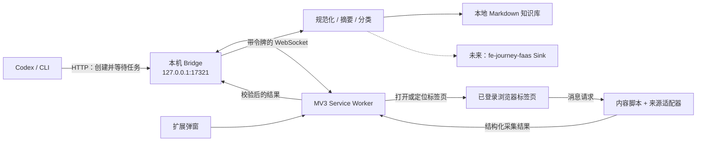

# Data Collector 产品与技术设计

**日期：** 2026-07-18  
**状态：** 已批准（需求方已明确授权自主完成产品与方案取舍）  
**目标版本：** 0.1.0

## 1. 产品定义

Data Collector 是一个本地优先的 Chrome 浏览器扩展，用于把用户有权访问的微信公众号文章、知识星球文章/动态/问答采集为可读、可搜索、可迁移的本地知识库。它同时提供一个本机桥接服务和 CLI，使 Codex 可以提交 URL，驱动已登录的浏览器完成采集，并取得最终文件路径。

首版解决四个核心任务：

1. 用户在当前页面点击扩展，保存完整正文、作者、时间、原链接、图片和结构化元数据。
2. 本地自动生成摘要、分类和关键词，并允许用户在采集前覆盖分类与标签。
3. Codex 或终端提交一个受支持的 URL 后，扩展自动打开页面、提取内容、关闭后台标签页并返回结果。
4. 所有内容默认只落在用户本机，形成稳定的 Markdown 目录，不上传云端。

### 1.1 成功标准

- 给定公开微信公众号链接可在 60 秒内保存为包含标题、公众号、发布时间、正文、原链接和图片引用的 Markdown。
- 在用户已登录知识星球网页版时，当前打开的文章、动态或问答可被识别并保存；若页面未登录或正文未加载，产品给出明确的“需要登录/打开内容”状态。
- CLI 可创建采集任务、等待浏览器回传，并输出生成文件的绝对路径。
- 相同规范化 URL 重复采集时更新同一条目并保留 `updated_at`，不制造重复目录。
- 桥接服务只监听回环地址，未配对的客户端不能提交或写入内容。

### 1.2 非目标

- 不批量爬取公众号历史、知识星球全部历史或绕过登录、付费、访问控制与反自动化措施。
- 不读取、导出或传输浏览器 Cookie、Local Storage、密码等凭证。
- 不在首版调用外部大模型或云服务；分类和摘要必须可离线运行。
- 不在首版部署云端同步，也不修改 `fe-journey-faas` 的线上函数。
- 不承诺还原页面视觉样式；本地成果以内容完整、Markdown 可读和可迁移为准。

## 2. 方案比较与决策

### 方案 A：扩展直接使用 Downloads API

扩展把每篇文章生成一个 Markdown 下载文件。

- 优点：组件最少，无本地常驻服务。
- 缺点：浏览器只能面向下载目录，难以可靠创建多文件条目、下载图片、维护索引、去重和更新；Codex 也没有稳定的双向任务通道。
- 结论：适合作为故障降级，不适合作为主架构。

### 方案 B：Chrome Native Messaging

扩展通过浏览器原生消息协议启动本机进程。

- 优点：浏览器官方支持，进程间通道边界明确。
- 缺点：需要把宿主清单安装到操作系统固定位置，并提前绑定扩展 ID；开发版、不同浏览器和多台机器的安装成本较高，不利于当前个人产品快速使用。
- 结论：安全性好，但首版运维成本超过收益。

### 方案 C：本机 Bridge + WebSocket/HTTP + CLI（采用）

一个仅监听 `127.0.0.1` 的 Node.js 服务负责任务队列、鉴权、文件写入和索引。扩展以 WebSocket 连接，Codex/CLI 以 HTTP 提交任务并等待结果。

- 优点：安装轻、可观察、易测试；能写任意配置目录、维护持久任务和图片；天然支持 Codex 与未来产品接入。
- 缺点：使用前需启动本机服务；Manifest V3 Service Worker 会休眠，需要心跳、重连和持久队列。
- 取舍：桥接服务提供一条命令启动；扩展每 20 秒心跳并在启动、浏览器启动和定时 alarm 时恢复连接；服务端在扩展重连后重发未完成任务。

## 3. 总体架构



### 3.1 仓库边界

首版所有新增代码位于 `/Users/chenhao/Code/data-collector`，采用一个 npm workspace：

- `packages/shared`：协议、数据模型、URL 规范化和运行时校验。
- `packages/extension`：Manifest V3 扩展、弹窗、后台任务协调和页面适配器。
- `packages/bridge`：回环 HTTP/WebSocket 服务、配对鉴权、队列、本地知识库写入、CLI。
- `tests/fixtures`：脱敏且固定的微信公众号/知识星球页面片段，保证选择器测试可重复。

实际可用服务端仓库位于 `/Users/chenhao/Code/midway/fe-journey-faas`。首版不修改它：云函数无法直接写本机目录，并且在需求尚未要求云同步时发送私人内容会扩大安全和隐私范围。Bridge 的 `ContentSink` 接口保留后续 `FaasSink`，届时可把相同 `CollectedDocument` 映射到现有内容系统。

## 4. 核心数据模型

`CollectedDocument` 是扩展与 Bridge 之间唯一的内容契约：

```ts
type Source = 'wechat' | 'zsxq';
type ContentKind = 'article' | 'post' | 'question' | 'answer';

interface CollectedDocument {
  schemaVersion: 1;
  source: Source;
  kind: ContentKind;
  url: string;
  canonicalUrl: string;
  title: string;
  author?: string;
  publishedAt?: string;
  collectedAt: string;
  html: string;
  text: string;
  images: Array<{ url: string; alt?: string }>;
  suggestedCategory?: string;
  suggestedTags?: string[];
  userCategory?: string;
  userTags?: string[];
  sourceMetadata?: Record<string, string | number | boolean | null>;
}
```

Bridge 不信任内容脚本传来的数据。它限制正文、标题、标签和图片数量/大小，拒绝非 HTTP(S) URL，清洗 HTML 中的脚本、事件属性、表单、iframe 与跟踪元素，然后再转为 Markdown。

## 5. 采集适配器

### 5.1 微信公众号

识别域名 `mp.weixin.qq.com`，优先使用稳定语义节点：标题 `#activity-name`，公众号 `#js_name`，正文 `#js_content`，时间 `#publish_time`，并兼容页面内 `msg_title`、`nickname`、`ct` 等已渲染字段。图片优先读取 `data-src`，其次 `src`，移除 1×1 像素和明显追踪资源。

给定冒烟链接已验证可直接返回完整 HTML，并包含 `#js_article`、`#js_name`、`#js_content` 及标题/公众号/发布时间页面变量。适配器仍以 DOM 为主，变量只作兼容回退，避免执行页面脚本。

### 5.2 知识星球

识别 `*.zsxq.com` 与 `wx.zsxq.com`。知识星球页面结构变化和登录依赖高，因此采用分层策略：

1. 优先读取文章详情、主题详情、问题和回答的已知语义容器及可访问性属性。
2. 若选择器未命中，对当前可见详情面板执行受限正文候选评分：文本长度、段落密度、标题邻近度和导航噪声占比。
3. 不采集列表流中的多个条目；无法唯一识别正文时返回 `UNSUPPORTED_LAYOUT`，提示用户打开单条详情。

适配器只观察当前 DOM，不调用知识星球内部接口、不注入主世界脚本、不读取身份凭证。

## 6. 本地归纳与目录格式

离线归纳包括：

- 摘要：从清洗后的段落中选择标题相关度、信息密度和位置得分最高的 2–4 句，最多 280 个汉字。
- 关键词：中文二至六字词组和英文词的 TF 频率，结合标题加权、停用词和技术词表，输出最多 8 个。
- 分类：可配置规则优先，其次使用关键词映射到 `前端开发`、`人工智能`、`产品与设计`、`商业与投资`、`效率与工具`、`生活与随笔`、`其他`。用户输入永远覆盖自动建议。

默认知识库目录为 `~/Documents/data-collector`，可用 `DATA_COLLECTOR_LIBRARY` 或 CLI 参数修改。布局如下：

```text
~/Documents/data-collector/
├── _catalog/
│   ├── index.json
│   └── jobs.json
├── 微信公众号/<分类>/<YYYY>/<slug>-<短哈希>/
│   ├── index.md
│   └── assets/
└── 知识星球/<分类>/<YYYY>/<slug>-<短哈希>/
    ├── index.md
    └── assets/
```

`index.md` 使用 YAML front matter，包含稳定 ID、schema 版本、来源、类型、原 URL、作者、发布时间、采集/更新时间、分类、标签和摘要。图片下载成功时改写为相对路径；下载失败时保留原 URL 并在元数据记录失败数。写入采用临时文件 + 原子重命名，目录由规范化 URL 的短哈希稳定定位。

## 7. 连接协议与任务状态

### 7.1 配对与安全

- Bridge 只绑定 `127.0.0.1`，拒绝非回环请求。
- 首次启动生成一次性 6 位配对码；扩展弹窗输入后换取随机 256 位令牌，令牌分别存入权限受限的本机配置文件和 `chrome.storage.local`。
- WebSocket 握手验证令牌和 `chrome-extension://` Origin；HTTP API 使用 Bearer token。日志从不打印令牌或正文。
- 只允许 `https://mp.weixin.qq.com/`、`https://wx.zsxq.com/` 和 `https://*.zsxq.com/` 任务 URL；拒绝 `file:`、`data:`、内网 URL 和重定向到非白名单来源。

### 7.2 协议

HTTP：

- `GET /health`：无需鉴权，仅返回服务版本和是否有扩展在线。
- `POST /v1/pair`：用一次性配对码换令牌。
- `POST /v1/jobs`：创建 URL 采集任务。
- `GET /v1/jobs/:id`：读取 `queued | dispatched | collecting | saved | needs_attention | failed`。

WebSocket 消息均含 `protocolVersion: 1`、`type`、`requestId` 和时间戳。主要消息为 `extension.hello`、`bridge.ping`、`job.collect`、`job.progress`、`job.result`、`job.error`。

### 7.3 Codex 使用路径

```bash
data-collector bridge start
data-collector collect 'https://mp.weixin.qq.com/s/…' --wait
```

第二条命令读取本机令牌，提交任务并轮询到终态；成功时标准输出只给出绝对 Markdown 路径，便于 Codex 继续读取、整理或导入其他系统。若没有扩展在线，任务保持 `queued` 并在超时后返回可操作提示，而不是丢失。

## 8. 扩展产品体验与视觉方向

弹窗宽 380px，信息层级围绕“这一页是否可采、保存到哪里、现在发生了什么”。视觉采用冷静的资料卡片气质：深墨蓝 `#14213D`、纸白 `#F7F8FA`、采集蓝 `#2F6BFF`、成功青 `#0E9F8A`、警告橙 `#D97706`、正文灰 `#394150`。中文正文使用系统无衬线字体，数字、状态和路径使用等宽字体。

标志性元素是一条“采集轨迹”：页面识别、内容清理、归纳、落盘四个状态沿一条细线依次点亮。它只在采集中出现，承担真实进度表达，不作为装饰。

弹窗状态：

- 未连接：显示 Bridge 启动命令、配对码输入和“连接本机”操作。
- 可采集：显示来源、页面标题、自动分类、可编辑标签和主操作“保存这一页”。
- 采集中：显示四段轨迹，禁止重复提交，仍可关闭弹窗；后台继续执行。
- 已保存：显示 Markdown 路径、“复制路径”和“在文件夹中查看”。
- 需处理/失败：说明是未登录、正文未打开、服务离线或页面结构变化，并给出唯一下一步。

所有交互支持键盘焦点；状态不能只靠颜色表达；尊重 `prefers-reduced-motion`；弹窗在 320–440px 宽度下不横向滚动。

## 9. 错误处理与恢复

- Service Worker 的连接状态存入 `chrome.storage.local`，不能依赖全局变量持久。WebSocket 断开后指数退避重连，并由每分钟 alarm 兜底。
- 每个任务以 `requestId` 幂等；Bridge 收到重复结果只更新同一条记录。
- 自动打开的标签页只有在成功或明确失败后关闭；需要登录/用户选择正文时保留并激活。
- 页面加载和采集分别有超时；错误使用稳定代码：`BRIDGE_OFFLINE`、`AUTH_REQUIRED`、`UNSUPPORTED_URL`、`UNSUPPORTED_LAYOUT`、`CONTENT_EMPTY`、`WRITE_FAILED`、`JOB_TIMEOUT`。
- 任务状态和索引原子写入，Bridge 重启后恢复非终态任务并在扩展上线时重发。

## 10. 测试与验收

### 10.1 单元测试

- URL 白名单、规范化、稳定 ID、slug 和路径穿越防护。
- 微信/知识星球 fixture 的标题、作者、时间、正文和图片提取。
- HTML 清洗、Markdown 转换、摘要、关键词、分类和用户覆盖规则。
- 协议校验、令牌校验、任务状态机、幂等更新和原子写入。

### 10.2 集成测试

- 启动临时 Bridge，完成配对、创建任务、模拟扩展 WebSocket 回传、写入 Markdown 和索引。
- 图片服务器成功/失败混合时，验证相对路径与失败回退。
- Bridge 重启后恢复排队任务；重复结果不会生成重复目录。

### 10.3 浏览器端到端测试

构建扩展并由 Puppeteer 加载 unpacked 产物；测试弹窗配对、当前页采集、Codex URL 任务和最终 Markdown 落盘。Service Worker 重连、失败恢复与错误界面由独立的后台和弹窗测试覆盖。浏览器测试只断言用户可见行为和生成文件，不依赖扩展内部实现。

### 10.4 真实冒烟

使用 `https://mp.weixin.qq.com/s/uW5gUigjslVY24YmCYhg0g`：

1. 在线 smoke 请求真实文章 HTML，并复用扩展生产提取器、组织器与知识库写入器。
2. 验证标题为“一夜之间，通胀的玩笑这次开大了”，公众号为“重远投资观”，正文非空且本地 Markdown 包含原链接。
3. 验证至少一张正文图片被保存或以远端 URL 明确回退。
4. 再次写入，验证路径和稳定 ID 不变，索引只保留一个条目。
5. unpacked 扩展、弹窗、Bridge、WebSocket 与 CLI URL 任务由独立 E2E 覆盖，避免把站点网络波动和浏览器启动问题混在同一测试中。

知识星球没有提供可公开复现链接，自动化采用 fixture；真实登录态验收通过扩展弹窗的诊断页和人工打开单条内容完成，不在测试中保存或自动化用户凭证。

## 11. 技术约束与依据

- Chrome Manifest V3，最低 Chrome 116。Chrome 官方说明 116 起 WebSocket 活动会刷新 Service Worker 的 30 秒空闲计时，20 秒心跳可维持连接：<https://developer.chrome.com/docs/extensions/how-to/web-platform/websockets>。
- 仅声明目标站点 host permissions、`activeTab`、`storage`、`alarms`；Chrome 官方建议尽量缩小权限并在适用时使用可选权限：<https://developer.chrome.com/docs/extensions/develop/concepts/declare-permissions>。
- 内容脚本视为不可信输入，所有消息执行运行时校验和清洗；依据 Chrome 扩展消息安全建议：<https://developer.chrome.com/docs/extensions/develop/concepts/messaging>。
- 端到端测试加载最终构建产物并断言外部行为，遵循 Chrome 官方扩展 E2E 建议：<https://developer.chrome.com/docs/extensions/how-to/test/end-to-end-testing>。

## 12. 后续演进

1. 增加 `FaasSink`，在用户明确启用后把 Markdown/结构化内容同步到 `fe-journey-faas`。
2. 接入可选的本地或 OpenAI 归纳器，但保留确定性离线回退与成本/隐私提示。
3. 支持批量队列、全文搜索、重复内容相似度和其他站点适配器。
4. 若产品进入多人分发，再评估 Native Messaging 安装器、Chrome Web Store 审核和签名更新通道。
