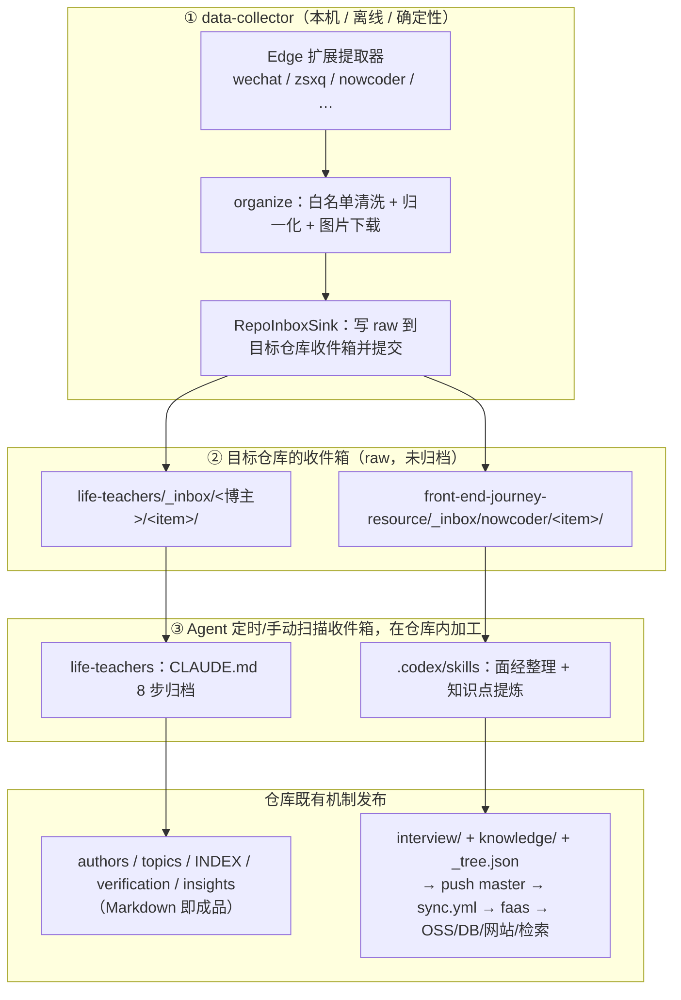

# Data Collector 演进方案：统一「采集器投原料 → Agent 在仓库内加工 → 仓库既有机制发布」

**日期：** 2026-07-24
**状态：** 草案 v2（已纳入需求方反馈：raw 落库 + Agent 定时归档，两条线同构）
**当前版本基线：** Data Collector 0.2.0
**涉及仓库：** `data-collector`、`life-teachers`、`front-end-journey-resource`、`fe-journey-faas`、`front-end-journey-manager`、`front-end-journey`

---

## 0. 一句话概述

把两条需求线统一成**同一个三段式管线**：

> **① data-collector 采集原始内容 → 投递到目标仓库的「收件箱(raw)」目录并提交 → ② Claude Code / Codex 等 Agent 定时扫描收件箱，在仓库内完成归档 / 整理 / 关键信息提炼 → ③ 目标仓库既有机制接手发布。**

采集器保持本机优先、离线、确定性，只当「可靠的原料投递者」；**一切「智能」（归档卡片、面经整理、知识点提炼）都在 Agent 层**，这正是需求方希望的分工。

---

## 1. 背景与关键事实

### 1.1 现状（data-collector 0.2.0）

「Edge 扩展 + 本机 Bridge + CLI」三件套，已跑通 微信/知识星球 → 本机 Markdown。原则：**本机优先、最小权限、固定身份、显式失败、幂等；默认不联网、不调大模型、不上云**（`docs/product.md`）。设计里早已预留 `ContentSink` 可插拔与「更多来源」扩展点，但 0.2.0 代码尚未落地：Bridge 直接 `MarkdownLibrary.save(organize(doc))`（`server/index.ts`），来源硬编码在 `shared/{model,url,protocol}.ts` 与 `extractors/index.ts` 四处。

约束（`docs/protocol.md`）：**云端 / 业务 sink 必须是 Bridge 写入后的独立模块，凭证只在 Bridge，扩展永不持有。**

### 1.2 两条需求线，同一个形状

**需求 1 — life-teachers（人生导师知识库）**
需求方明确：用 data-collector 把博主原文**存进 life-teachers 的一个「原始未归档文章」文件夹**，再让 Claude Code / Codex 定时扫描、归档、总结、提取关键信息。
- life-teachers 现状：纯 Markdown 知识库，归档是一套 **Claude 8 步工作流**（`life-teachers/CLAUDE.md`：确认元信息→存档原文→写归档卡片→更新博主档案→更新主题库→更新总索引→工程验证→提交）。无服务、无自动化。**「归档由 Claude 做」本就是既定事实**，缺的只是「原文自动录入」这一步。

**需求 2 — agent-journey（fe-journey 生态）**
从牛客网收集面经贴 → 整理成规范面经贴更新到网站 → 提炼知识点同步到知识库；未来作为文章/项目前置输入。需求方希望**采用与 life-teachers 相同的思路**。

关键发现 —— **这条线的「Agent 在仓库内加工 + git 发布」模式已经存在并跑通**：
- `front-end-journey-resource/.codex/skills/generate-knowledge-docs/`（Codex skill）已实现：以 resource 仓库为唯一真相源，Agent 在仓库内生成/更新 **knowledge** 文档，**「发布」= branch→PR→merge master，由仓库的 Action 完成同步**；并规定「发布只改 resource 仓库，不碰 faas/manager」。
- 发布机制齐备：`interview`/`knowledge` 文章 = `{module}/{filePath}/{key}.md` + `_tree.json` 清单；push master → `.github/workflows/sync.yml` → `POST /content/sync`（faas）→ OSS + DB navConfig + `article_content` ngram 检索索引 → 网站与站内检索自动更新。
- resource README 明确「本地编辑 git push / 后台界面经 faas 提交，两条路都收敛到本仓库」——**git 路径是一等公民**。

所以 agent-journey 缺的是两块，且都与 life-teachers 同构：
1. **采集腿**：把牛客原始面经投进仓库当输入（data-collector，全仓 grep 确认 faas 目前无任何 nowcoder 抓取代码）。
2. **面经加工 skill**：与已有 `generate-knowledge-docs` 并列的「面经→规范面经贴 + 提炼知识点」skill。

> 备选路径（保留不主推）：faas 侧其实已有面经 **DB 暂存**通道 —— 表 `interview_experience`（`title/content/url/author/publishTime/aiTitle/aiContent/status/source=nowcoder`）+ `POST /interview/save` + manager「面经管理」页。它与「raw 文件夹 + Agent + git」是**两条可并存的路**；按需求方偏好，本方案主推后者（git 原生、与 knowledge skill 一致），DB/后台路径作为未来可选的审核/统计增强。

### 1.3 目标与非目标

**目标**：① 采集器支持新增来源（首个：牛客），加来源尽量声明式；② 落地 `ContentSink` 抽象 + 通用 `RepoInboxSink`（把 raw 投进任意目标仓库的收件箱）+ 路由；③ 两条线都跑通「投原料→Agent 加工→仓库发布」；④ 凭证只在 Bridge。

**非目标**（继承 0.2.0）：不批量爬取 / 不绕过登录付费验证码反自动化（牛客沿用「已登录、开详情页再保存」单页模式）；不采集 Cookie/密码；扩展不引入 `<all_urls>`；采集层默认不调大模型（智能在 Agent 层）。

---

## 2. 总体架构：三段式统一管线



**为什么这样切分**
1. **符合需求方意图**：智能全在 Agent 层，采集器只投原料。
2. **两条线同构**：一套心智模型、一套工具（git）、一套触发（定时 Agent 扫描）。
3. **最大化复用**：life-teachers 的 Claude 工作流、resource 的 `generate-knowledge-docs` skill 与 sync.yml 发布链 —— 全部已存在，本方案主要是「补采集腿 + 补面经 skill + 接线」。
4. **守住边界**：采集器无需 LLM、无需云凭证；扩展不接触任何业务密钥。

**采集器与 Agent 的交接契约（关键）**
Agent 可能跑在**临时克隆环境**（Claude Code on the web 每次新 clone）。因此 raw 投递**必须提交并推送**到 Agent 能拉到的位置，否则 web 会话看不到。约定：
- raw 收件箱位于目标仓库**顶层 `_inbox/`**（在内容模块目录之外，faas 的 `syncChanged` 对非模块路径返回 no-op，不会误发布）。
- 采集器把 raw 提交到**专用分支**（如 `collector/inbox`）或顶层 `_inbox/`；resource 仓库为避免 raw 提交触发空跑 CI，给 `sync.yml` 增加 `paths-ignore: ['_inbox/**']`。
- Agent 加工产出走既有 **branch→PR→merge master** 流程；合并同一 PR 内删除对应 raw 条目。

---

## 3. 采集层设计（data-collector）

### 3.1 来源注册表（`packages/shared`）

把「加来源要改四处」收敛为声明式单一真相源：

```ts
// packages/shared/src/sources.ts（新增）
export interface SourceDescriptor {
  id: Source;                         // 'wechat' | 'zsxq' | 'nowcoder' | …
  matchHost: (host: string) => boolean;
  identityParams: readonly string[];  // 规范化保留的身份参数（支持 path 段规则）
  kinds: readonly ContentKind[];
  defaultKind: ContentKind;
  defaultInbox?: string;              // 默认路由到哪个 sink/收件箱
}
export const SOURCE_REGISTRY: Record<Source, SourceDescriptor> = { /* … */ };
```

`url.ts` / `protocol.ts` / `extractors/index.ts` 改读注册表，去掉「wechat→article 否则 zsxq」硬编码（牛客身份多在 path 段，需支持 path 规则）。扩展侧提取器仍需按来源写 DOM，但注册集中一处。

### 3.2 牛客提取器（`packages/extension`）

新增 `extractors/nowcoder.ts`，处理牛客面经详情页，提取 `title/author/publishTime/正文/图片`；正文归一化复用 `extractors/common.ts`。未登录/反自动化/结构不支持 → `ExtractionError` → 任务 `needs_attention`，不绕过。`manifest.json` 的 `host_permissions` 显式加入牛客域。

### 3.3 `ContentSink` 抽象 + 通用 `RepoInboxSink`（`packages/bridge`）

落地早已预留的 `ContentSink`；两条线共用**同一个** sink：

```ts
export interface ContentSink { readonly id: string; save(doc: OrganizedDocument): Promise<SinkResult>; }
```

| Sink | 目标 | 说明 |
|------|------|------|
| `MarkdownLibrarySink` | 本机 | 包住现有 `MarkdownLibrary`，默认开启、行为不变（0.2.0 向后兼容） |
| `RepoInboxSink` | 任意 git 仓库收件箱 | 把 raw 写成 `original.md`+`meta.json`+`assets/` 投到 `<repoPath>/<inboxDir>/<source>/<item>/`，按配置 `git add/commit/push` |

收件箱条目格式（两条线一致）：
```
<repoPath>/_inbox/<source>/<YYYY-MM-DD>-<id>-<slug>/
  original.md   # frontmatter(title/author/date/source/url/archived_at) + 原文正文（原样）
  meta.json     # source,url,author,publishedAt,collectedAt,images[],suggestedCategory,suggestedTags
  assets/…      # 随文图片（复用 library/assets.ts 的 SSRF 防护下载管线）
```

**路由**：`configDir/sinks.json`（`0600`，仅 Bridge 读，扩展不接触）声明 来源→sink 与各 sink 参数（仓库路径、收件箱目录、分支、是否 autoCommit/push、业务凭证）。CLI `--sink`、Side Panel、`POST /v1/jobs` 三处可覆盖来源默认路由。管线改动仅在 `server/index.ts` 的 `job.result` 分支：`organize` → 查路由 → 逐 sink `save`；**未配置的来源仍只落本机库**。

---

## 4. 加工层：Agent skill / 工作流（在目标仓库内）

采集器不产出成品，成品由各仓库的 Agent 指令产出。两条线各有「加工说明书」，放在各仓库既有的 Agent 指令位置。

### 4.1 life-teachers（复用 + 小扩展）

- 新增 `_inbox/` 约定 + `_inbox/README.md`（投递格式说明）。
- `CLAUDE.md` 增加「从 `_inbox` 批量归档」小节：Agent 列出 `_inbox/*` → 对每条执行既有 8 步（原文已在 `original.md`，省去手动粘贴）→ 归档后移除该 raw 条目 → 按现有规范提交。**归档质量、验证、跨博主关联仍由 Claude 完成。**

### 4.2 fe-journey（复用 knowledge skill 的成熟模式，新增面经 skill）

- 新增 `_inbox/nowcoder/` 收件箱（顶层，模块目录之外）。
- 新增 `.codex/skills/curate-interview-posts/`（与 `generate-knowledge-docs` 并列，同一套约定）：扫描 `_inbox/nowcoder/*` → 对每条面经
  1. 生成规范**面经贴** → `interview/<公司>/<key>.md` + upsert `_tree.json` 叶子（label/key/filePath/tags）；
  2. **提炼知识点** → 新建或并入 `knowledge/<...>/<key>.md` + `_tree.json`（可直接复用 `generate-knowledge-docs` 生成知识点正文）；
  3. **脱敏**（面经常含真实姓名/公司/薪资/联系方式，公开发布前必须处理）；
  4. 删除对应 raw 条目；走 branch→PR→merge master。
- 合并 master 后，`sync.yml` → faas 自动同步到 OSS/DB/网站/检索。**发布只改 resource 仓库**（沿用既有 skill 铁律，不碰 faas/manager）。

### 4.3 Agent 触发方式

- **手动**：对目标仓库会话说「处理收件箱」。
- **定时**：Claude Code on the web 的 Routine / 定时会话（本环境可配置），周期性 drain 收件箱后自动加工提交；或 Codex 定时任务。
- **投递即提醒**：采集器提交 raw 后本机通知「N 篇待归档」。

---

## 5. 分期实施计划

统一在各仓库 `claude/relaxed-gates-dhhw1m` 分支开发。

| 阶段 | 内容 | 主要仓库 | 验收 |
|------|------|----------|------|
| **P0** | 本设计评审、决策落定 | 本 doc | 需方确认 §6 决策 |
| **P1** | 采集层地基：`ContentSink` 抽象 + `RepoInboxSink` + 来源注册表重构（**零行为变更**，本机库照旧）+ `sinks.json` 路由 | `data-collector` | wechat/zsxq 全绿；sink/路由/inbox 单测 |
| **P2** | life-teachers 线（更近需方直觉、无 CI 风险，先做）：牛客无关，先用 wechat/zsxq → `_inbox` + life-teachers `_inbox` 约定 + CLAUDE.md 归档流（+ 可选定时 Routine） | `data-collector` / `life-teachers` | 采集博主文 → `_inbox` → Agent 归档为 summary.md + 更新 INDEX |
| **P3** | agent-journey 采集腿：牛客提取器 + `RepoInboxSink` 投到 resource `_inbox/nowcoder` + `sync.yml` 加 `_inbox` paths-ignore | `data-collector` / `-resource` | 开牛客面经页保存 → resource `_inbox/nowcoder` 出现 raw 条目 |
| **P4** | agent-journey 加工 skill：`curate-interview-posts`（面经贴 + 知识点 + 脱敏）→ PR→merge→sync 发布 | `-resource` | Agent 跑一遍 → 网站出规范面经贴 + 知识点，站内可检索 |
| **P5** | 通用输入源/future：受控白名单通用正文抽取；采集库导出/RAG 作为文章/项目前置输入；（可选）接回 faas DB 暂存做统计/审核台账 | `data-collector`(+faas) | 按需 |

> 排序把 **life-teachers 线提前到 P2**：它无 CI、无发布链风险、最贴近需求方当下直觉，能最快验证「投原料→Agent 归档」闭环；牛客线(P3/P4)在地基之上叠加。

---

## 6. 待决策项

1. **收件箱位置**：life-teachers 用顶层 `_inbox/`；fe-journey 用 resource 顶层 `_inbox/nowcoder/`（模块目录外）。是否认可？（也可放专用分支 `collector/inbox`。）
2. **采集器是否自动 commit + push raw？** 若 Agent 跑在 Claude Code web（临时克隆），**必须 push**，故推荐 `autoCommit+push: true`；若只用本机 Codex，可只写盘不提交。你的 Agent 主要跑在哪？
3. **Agent 触发**：手动 / 定时 Routine / 两者。需要我顺便配一个「定时扫描收件箱并归档」的 Routine 吗？
4. **牛客采集范围**：仅「当前登录页保存」（推荐，合非目标）vs 受控「提交 URL 列表」小批量。
5. **面经脱敏 + 发布把关**：默认「Agent 生成 + branch→PR→你 merge 前人工过一眼」即为把关点（涉及 PII/公开）。是否够，还是要更强审核（接回 manager 后台）？
6. **是否保留 faas DB 暂存路径**：主推 git 路径；`interview_experience`/manager 页作为未来可选台账，暂不改动，可否？
7. **faas 生产 `GITHUB_API_BASE`**：`sync.ts` 默认值仍指向旧 `front-end-journey`，确认线上已切到 `front-end-journey-resource`（影响 P4 发布落点）。

---

## 7. 信任边界与风险

- **凭证**：业务/云 sink 密钥只在 Bridge `sinks.json`（`0600`），扩展永不持有（继承 `protocol.md`）。
- **站点合规**：牛客沿用已登录会话、单页保存、显式域名；不绕过登录/反自动化、不批量爬取。
- **PII**：面经含个人信息，公开发布前必须脱敏 + PR 前人工过目。
- **幂等**：raw 按稳定内容 ID 命名（重复采集覆盖同条目）；面经/知识点按稳定 `key`（`_tree.json`+OSS）；本机库按内容 ID。三链路可重复采集不产重复。
- **CI 洁净**：resource `_inbox/` 加 `paths-ignore`，raw 提交不触发空跑 sync；发布仍只由 master 上的模块目录变更驱动。
- **向后兼容**：P1 纯重构，默认路由=现状，未配置新 sink 的用户无感。

---

## 8. 各仓库改动清单（P1–P4）

- **data-collector**：`shared/sources.ts`（来源注册表）+ 改 `url/protocol/model.ts`、`extractors/index.ts` 读注册表；`extension/src/extractors/nowcoder.ts` + `manifest.json` host；`bridge/src/sinks/*`（`types` + `MarkdownLibrarySink` + `RepoInboxSink`）+ `config.ts` 读 `sinks.json` + `server/index.ts` 路由；配套单测/e2e。
- **life-teachers**：`_inbox/` + `_inbox/README.md`；`CLAUDE.md` 增「从 `_inbox` 归档」小节。
- **front-end-journey-resource**：`_inbox/nowcoder/`（约定）；`.codex/skills/curate-interview-posts/`（新 skill）；`.github/workflows/sync.yml` 加 `paths-ignore: ['_inbox/**']`。
- **fe-journey-faas / -manager / front-end-journey**：主推路径下**无需改动**（发布经既有 sync 链）。仅当选择「接回 DB 暂存/后台审核」时才涉及（P5 可选）。
```
