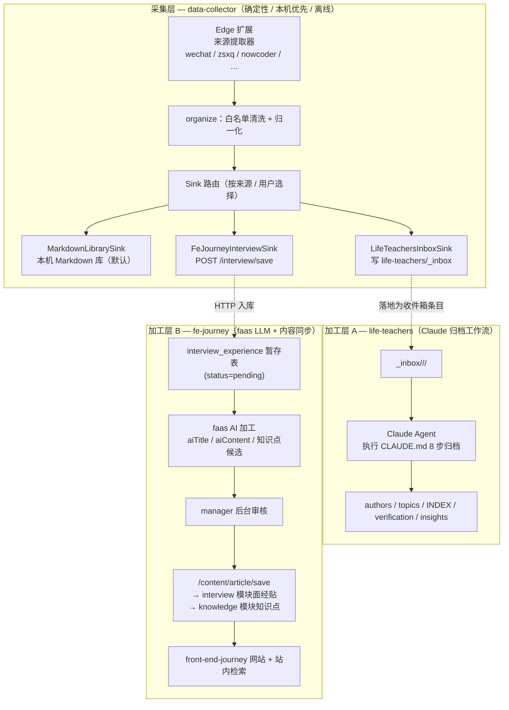

# Data Collector 演进方案：多源采集 + 可路由 Sink + 下游加工

**日期：** 2026-07-24
**状态：** 草案（待需求方评审）
**当前版本基线：** Data Collector 0.2.0
**涉及仓库：** `data-collector`、`life-teachers`、`front-end-journey-resource`、`fe-journey-faas`、`front-end-journey-manager`、`front-end-journey`

---

## 0. 一句话概述

把 Data Collector 从「微信 / 知识星球 → 本机 Markdown」的两源单向采集器，演进为一个**多源采集、可路由到多个下游知识库的采集平台**；采集层保持本机优先、离线、确定性，把「需要智能理解的归档 / 加工」交给各下游系统已有的能力（life-teachers 的 Claude 归档工作流、fe-journey-faas 的 LLM 与内容同步链路）。

---

## 1. 背景与目标

### 1.1 现状（data-collector 0.2.0）

Data Collector 现在是一个 **Edge 扩展 + 本机 Bridge + CLI** 的三件套（`packages/{shared,bridge,extension}`）：

- **扩展**在受支持页面（`mp.weixin.qq.com`、`wx.zsxq.com` 及其子域）从当前 DOM 提取结构化 `CollectedDocument`（`packages/extension/src/extractors/*`）。
- **Bridge**（`127.0.0.1:17321`）负责固定身份自动授权、任务队列（`jobs/store.ts`）、离线整理（`organize/*`：白名单清洗 + 启发式摘要 / 分类 / 关键词）、落盘（`library/writer.ts` 原子写 Markdown + 图片下载 + `_catalog` 索引）。
- **CLI / Codex**通过 HTTP 提交 URL、等待回传文件路径。

核心原则（`docs/product.md`）：**本机优先、最小权限、固定身份、自动授权、显式失败、稳定幂等；默认不联网、不调用大模型、不上云。**

关键约束（`docs/protocol.md` §「扩展为其他客户端」）：**云端 sink 必须是 Bridge 写入之后的独立模块，不能让扩展持有云端长期凭证。**

设计文档里其实**早已预留了扩展点**（`docs/superpowers/specs/2026-07-18-data-collector-design.md` §11、`docs/product.md` §「后续演进」）：

> 1. 可插拔 `LibrarySink`：本机目录、业务 API 或用户授权的知识库。
> 5. 更多来源仍采用显式域名和专用提取器，不引入无限制 `<all_urls>` 权限。

但 0.2.0 实际代码里，Bridge 直接调用 `MarkdownLibrary.save(organize(doc))`（`server/index.ts`），**`ContentSink` 抽象尚未落地**，来源也硬编码在 `shared/model.ts`、`shared/url.ts`、`shared/protocol.ts`、`extractors/index.ts` 四处。本方案要把这些预留点真正实现。

### 1.2 两条需求线

**需求 1 —— 给 life-teachers 自动化收集 + 归档落库。**
`life-teachers` 是一个纯 Markdown 的「人生导师」知识库（`authors/<博主>/articles/<日期-标题>/{original.md,summary.md}` + `topics/` + `INDEX.md` + `verification/` + `insights/`）。归档是一套 **8 步 Claude 工作流**（`life-teachers/CLAUDE.md`）：确认元信息 → 存档原文 → 写归档卡片 → 更新博主档案 → 更新主题库 → 更新总索引 → 工程验证 → 提交推送。目标是让采集器自动把博主文章送进来，减少「手动粘贴原文」这一步。

**需求 2 —— 给副业 agent-journey 收集 resource。**
典型场景：从**牛客网**收集**面经贴** → 整理成规范面经贴更新到网站 → 提炼**知识点**同步到知识库。未来还要作为文章 / 项目的前置输入源。

这条线的下游基建**大部分已存在**（`fe-journey-faas` + `front-end-journey-resource` + `front-end-journey-manager` + `front-end-journey`）：

- **已有面经暂存表**：`fe-journey-faas/src/entity/interview.ts`（表 `interview_experience`）字段为 `title / content / url / author / publishTime / aiTitle / aiContent / status / source`，`source` 默认 `'nowcoder'`、`status` 默认 `'verified'`。
- **已有暂存写入接口**：`POST /interview/save`（`function/interview.ts`，`@NoAuth`，按 `url` upsert）。
- **已有面经管理后台页**：`front-end-journey-manager/src/pages/Interview`。
- **已有内容发布链路**：`interview` / `knowledge` 模块的文章 = `front-end-journey-resource` 里的 `{module}/{filePath}/{key}.md` + `_tree.json` 清单；通过 `POST /content/article/save`（写 GitHub + OSS + `_tree.json` + DB navConfig + `article_content` ngram 检索索引，`function/content.ts` / `service/content/sync.ts`）发布；或本地编辑 push，由 `sync.yml` 触发 `POST /content/sync` 增量同步。
- **已有 LLM / 检索基建**：`service/ai/*`（qwen 默认）、`service/embedding`（text-embedding-v4 面经聚类 / 语义检索）、`service/ai/retrieve.ts`（站内召回）。

也就是说：**「面经暂存」这张桌子已经摆好，就差一条把牛客内容送上桌的采集腿** —— 目前 faas 里没有任何 nowcoder 抓取代码（全仓 grep 仅有那两处默认值）。data-collector 正是要补上这条腿。

### 1.3 目标与非目标

**目标**

1. 采集层支持新增来源（首个新增：牛客网），且「加一个来源」尽量变成**声明式配置 + 一个提取器**，而不是四处改代码。
2. 引入 `ContentSink` 抽象与**路由**：一篇采集结果可按来源 / 用户选择落到一个或多个下游（本机库、life-teachers 收件箱、fe-journey 面经暂存）。
3. 打通两条需求线的**端到端链路**，且尽量复用各下游已有能力，不重复造轮子。
4. 严守既有信任边界：云端 / 业务 sink 的凭证只在 Bridge，扩展永不持有。

**非目标（继承 0.2.0，并明确本方案同样不做）**

- 不做批量历史爬取、定时全站爬取、绕过登录 / 付费 / 验证码 / 反自动化。牛客沿用「你已登录、打开某条详情页再保存」的单页模式。
- 不采集 Cookie / LocalStorage / 密码。
- 扩展不引入 `<all_urls>`，每个来源都是显式域名 + 专用提取器。
- 采集层默认不调用大模型；智能加工放到已有 LLM 能力所在处。

---

## 2. 总体架构：两层「采集—加工」流水线

核心判断：**life-teachers 的高质量归档卡片（核心观点 + 支撑逻辑 + 可验证项 + 跨博主关联 + 验证代码）和「面经 → 知识点」的提炼，都需要真正的 LLM 推理，不适合塞进采集器的启发式管线。** 因此把系统切成两层：



**为什么这样切分**

1. **尊重采集层的边界**：本机优先、离线、最小信任（`product.md` / `protocol.md`）。采集层不背 LLM、不背云凭证给扩展。
2. **尊重质量门槛**：life-teachers 归档是 Claude 擅长的深度分析 + 写验证代码；面经 → 知识点是 faas 已经具备的 LLM 能力。
3. **最大化复用既有契约**：`interview_experience` 暂存 + `/interview/save`、`/content/article/save` 全套同步机、life-teachers 的 Claude 工作流、manager 审核页 —— 都已存在，本方案主要是「接线」。

---

## 3. 采集层设计（data-collector）

### 3.1 来源注册表（`packages/shared`）

**问题**：现在加一个来源要改四处 —— `model.ts` 的 `SOURCES`、`url.ts` 的 host 常量 + 身份参数 + `parseSupportedUrl` / `canonicalizeUrl`、`protocol.ts` 的 `superRefine`（还硬编码了「wechat→article，否则 zsxq」）、`extractors/index.ts` 的 `detectSource`。牛客的内容模型和这套「二选一」假设不兼容。

**方案**：引入声明式 `SourceDescriptor` 注册表，作为 URL 校验、规范化、协议校验、路由默认值的**单一真相源**。

```ts
// packages/shared/src/sources.ts（新增）
export interface SourceDescriptor {
  id: Source;                         // 'wechat' | 'zsxq' | 'nowcoder' | ...
  matchHost: (host: string) => boolean;
  identityParams: readonly string[];  // 规范化时保留的身份参数（可含 path 规则）
  kinds: readonly ContentKind[];      // 该来源允许的内容类型
  defaultKind: ContentKind;
  defaultSinks: readonly string[];    // 路由默认（可被 job / 用户覆盖）
}
export const SOURCE_REGISTRY: Record<Source, SourceDescriptor> = { /* … */ };
```

- `url.ts` / `protocol.ts` / `extractors/index.ts` 改为读注册表（`SOURCES` 由 `Object.keys` 派生），去掉「wechat→article 否则 zsxq」硬编码。
- 扩展侧提取器仍需为每个来源写 DOM 代码（不可避免），但**注册集中一处**。「更多来源」从跨文件手术降级为「加一条注册 + 一个提取器」。
- 牛客可能用 path 段（帖子 id）而非 query 做身份，`canonicalizeUrl` 需支持「按来源自定义身份提取」，因此 `identityParams` 允许描述 path 规则。

### 3.2 牛客提取器（`packages/extension`）

- 新增 `extractors/nowcoder.ts`，处理牛客面经详情页（`www.nowcoder.com` 的 `discuss` / `feed/main/detail` 等），提取 `title / author / publishTime / 正文 / 图片`。
- 内容类型：为牛客用 `kind: 'post'`（复用现有枚举）或新增 `'interview'`；正文归一化复用 `extractors/common.ts` 的 `normalizeContent`（去脚本 / 追踪像素、图片绝对化）。
- 未登录 / 反自动化 / 结构不支持 → 抛 `ExtractionError`，任务进入 `needs_attention`，不尝试绕过。
- host 加入 allowlist（`url.ts` 的 `parseSupportedUrl`）；`manifest.json` 的 `host_permissions` 增加牛客域（保持显式，不用 `<all_urls>`）。

### 3.3 `ContentSink` 抽象 + 路由（`packages/bridge`）

**落地早已预留的 `ContentSink`**：

```ts
// packages/bridge/src/sinks/types.ts（新增）
export interface SinkResult {
  sinkId: string;
  ok: boolean;
  outputRef: string;      // 本机文件路径 / 收件箱路径 / 远端记录 id
  detail?: Record<string, unknown>;
}
export interface ContentSink {
  readonly id: string;
  save(doc: OrganizedDocument): Promise<SinkResult>;
}
```

三个实现：

| Sink | 位置 | 目标 | 凭证 |
|------|------|------|------|
| `MarkdownLibrarySink` | 本机 | 现有 `MarkdownLibrary`（默认，永远开启，行为不变） | 无 |
| `LifeTeachersInboxSink` | 本机文件 | 写 `life-teachers` 仓库 `_inbox/` 收件箱 | 无（本地仓库路径） |
| `FeJourneyInterviewSink` | HTTP | `POST ${FAAS_BASE}/interview/save` | Bridge 配置里的 base URL + ingest 密钥 |

**路由**：`configDir` 下新增 `sinks.json`（`0600`），描述来源 → sink 列表与各 sink 参数：

```jsonc
{
  "routes": {
    "wechat":   ["markdown"],
    "zsxq":     ["markdown"],
    "nowcoder": ["fe-journey-interview"]
  },
  "sinks": {
    "markdown":  { "type": "markdown" },
    "life-teachers": { "type": "life-teachers-inbox", "repoPath": "~/Code/life-teachers", "autoCommit": false },
    "fe-journey-interview": { "type": "fe-journey-interview",
      "baseUrl": "https://fe-journey-main-….fcapp.run", "ingestSecret": "…", "status": "pending" }
  }
}
```

- 管线改动（`server/index.ts` 的 `job.result` 分支）：`organize(doc)` → 查路由 → 逐个 `sink.save()` → 任务记录 `outputPath`（多 sink 时汇总）。**默认路由不变**：未配置的来源仍只落本机库，保证 0.2.0 行为向后兼容。
- 覆盖：CLI `--sink`、Side Panel sink 选择器、`POST /v1/jobs` 的 payload 字段，三处均可覆盖来源默认路由。
- **凭证边界**：`sinks.json` 只被 Bridge 读取，扩展从不接触 —— 完全符合 `protocol.md`「云端 sink 应是 Bridge 写入后的独立模块」。

### 3.4 归一化产物到各目标的映射

采集层已产出 `OrganizedDocument`（`document` + `sanitizedHtml` + `summary` + `category` + `tags`）。各 sink 的字段映射：

**→ fe-journey 面经暂存（`/interview/save`）**

| interview_experience | 来源 |
|----------------------|------|
| `title` | `document.title` |
| `content` | `markdown(sanitizedHtml)`（复用 `writer.ts` 的 turndown） |
| `url` | `document.canonicalUrl` |
| `author` | `document.author` |
| `publishTime` | `document.publishedAt` |
| `source` | `'nowcoder'` |
| `status` | `'pending'`（见 §5.3 生命周期） |

**→ life-teachers 收件箱**（目录结构见 §5.1），落 `original.md`（life-teachers 期望的 frontmatter：`title / author / date / source / archived_at`）+ `meta.json` + `assets/`。图片下载复用 `library/assets.ts` 的 SSRF 防护管线。

---

## 4. 加工层 B：面经 → 面经贴 + 知识点（fe-journey）

这是需求 2 的下游，主体在 `fe-journey-faas` + `front-end-journey-manager`，**复用为主、少量新增**。

### 4.1 AI 加工（faas 新增）

新增一个 AI 任务 / 接口：输入一条 `interview_experience`（raw `content`），用现有 LLM（`LLM_PROVIDER=qwen`，`service/ai/*`）产出：

- `aiTitle`：规范化标题（公司 + 岗位 + 轮次）。
- `aiContent`：清洗后的面经贴 Markdown（结构化问答、去除噪声、脱敏）。
- **知识点候选**：`[{ suggestedModule: 'knowledge', suggestedPath, title, body, relatedInterviewKey }]`。可结合 `service/embedding`（题目聚类）判断知识点是**新建**还是**并入已有** knowledge 叶子（用 `retrieve.ts` / 向量召回找相似知识点）。

写回：`aiTitle` / `aiContent` 存回该行；知识点候选存新表或复用 `questionCluster`。

### 4.2 审核 + 发布（manager + faas 复用）

- `front-end-journey-manager` 的「面经管理」页扩展：展示 raw vs AI 结果对比、可编辑、审核。
- 审核通过 →
  1. 面经贴：调 `POST /content/article/save`（`module: 'interview'`，选定 `parentKey`/公司分组、`filePath`、`key`、`label`、`tags`、`content=aiContent`）——自动写 GitHub + OSS + `_tree.json` + DB + ngram 索引。
  2. 每个通过的知识点：新建 `knowledge` 叶子，或把内容并入既有叶子（同样走 `/content/article/save`）。
  3. `interview_experience.status` → `'published'`，回填发布出去的 `articleKey`。
- 发布后，`front-end-journey` 网站与站内检索（`retrieve.ts` + `article_content` ngram + embedding）自动可见。

### 4.3 faas 侧安全加固

- `POST /interview/save` 目前 `@NoAuth`（任何人可写暂存表）。建议加共享密钥头（对齐 `/content/sync` 的 `x-sync-secret` 模式，记为 `x-ingest-secret`），只有 Bridge 的 `FeJourneyInterviewSink` 持有。
- **PII / 脱敏**：面经常含真实姓名、公司、薪资、联系方式。§4.1 的 `aiContent` 生成必须包含脱敏；发布前人工审核兜底（§7）。

---

## 5. 加工层 A：life-teachers 自动归档

life-teachers 现在是**纯 Claude 工作流**（无服务、无自动化）。本方案不改变「Claude 负责归档」这一事实，只是给它加一个**收件箱**入口。

### 5.1 收件箱约定（life-teachers 新增）

```
life-teachers/_inbox/<source>/<YYYY-MM-DD>-<id>-<slug>/
  original.md   # frontmatter(title/author/date/source/archived_at) + 原文正文（原样）
  meta.json     # source,url,author,date,images[],collectedAt,suggestedCategory,suggestedTags
  assets/…      # 随文图片
```

新增 `_inbox/README.md` 说明投递格式。`.gitignore` 不忽略 `_inbox`（要能被 agent 看到与提交）。

### 5.2 归档工作流（扩展 `life-teachers/CLAUDE.md`）

在 CLAUDE.md 增加「从 `_inbox` 批量归档」小节：agent 列出 `_inbox/*` → 对每条执行现有 8 步（原文已在 `original.md`，省去手动粘贴）→ 归档完成后把该条移出 `_inbox`（或删除）→ 按现有 commit 规范提交。**归档质量、验证、跨博主关联仍由 Claude 完成**，收件箱只解决「原文录入」这一步的自动化。

### 5.3 触发方式（三选一，见 §7 决策）

- 手动：用户对 life-teachers 会话说「处理收件箱」。
- 定时：Claude Code on the web 的 Routine / 定时会话，周期性 drain 收件箱。
- 采集即提示：`LifeTeachersInboxSink` 落盘后，通过本机通知提醒「有 N 篇待归档」。

### 5.4 采集端到 life-teachers 的边界

`LifeTeachersInboxSink` **只写收件箱、默认不 commit/push**（`autoCommit:false`）—— 归档卡片、INDEX、验证都要 Claude 生成，采集器不该替它提交半成品。是否允许自动 commit 由用户决定（§7）。

---

## 6. 分期实施计划

统一在各仓库的 `claude/relaxed-gates-dhhw1m` 分支开发。

| 阶段 | 内容 | 主要仓库 | 产出 / 验收 |
|------|------|----------|-------------|
| **P0** | 本设计评审、决策落定 | 本 doc | 需方确认 §7 决策 |
| **P1** | 采集层地基：`ContentSink` 抽象 + 路由 + 来源注册表重构（**零行为变更**，`MarkdownLibrarySink` 包住现有库） | `data-collector` | 现有 wechat/zsxq 用例全绿；新增 sink/路由单测 |
| **P2** | UC2 采集腿：牛客提取器 + `FeJourneyInterviewSink` + faas `/interview/save` 加密钥 + status 生命周期（pending） | `data-collector` / `fe-journey-faas` | 打开牛客面经页 → `interview_experience` 出现一条 pending |
| **P3** | UC2 加工 + 发布：faas AI 加工（aiTitle/aiContent/知识点候选）+ manager 审核发布 → interview/knowledge 模块 | `fe-journey-faas` / `-manager` / `-resource` | 审核通过 → 网站出现规范面经贴 + 知识点，站内可检索 |
| **P4** | UC1 life-teachers：`LifeTeachersInboxSink` + `_inbox` 约定 + CLAUDE.md 归档流（+ 可选定时 drain） | `data-collector` / `life-teachers` | 采集博主文章 → 收件箱 → Claude 归档为 summary.md + INDEX |
| **P5** | 通用输入源 / future：受控白名单的通用正文抽取（Readability 式）；采集库导出 / RAG 索引，作为文章 / 项目前置输入 | `data-collector`（+ faas） | 按需 |

---

## 7. 待决策项（需要需求方拍板）

1. **智能加工放在哪？**（推荐：面经 → faas 现成 qwen；life-teachers → Claude agent。也可两者都用 Claude。）
2. **life-teachers 自动化程度？**（推荐：采集落 `_inbox`，由 Claude 手动 / 定时归档；采集器**不**自动 commit。）是否允许 sink 自动 `git commit`？触发用手动还是定时 Routine？
3. **面经发布是否要人工审核？**（推荐：faas 出 AI 稿 → manager 人工审核后发布，因涉及 PII 与公开发布。）是否要「高置信度自动发布」通道？
4. **牛客采集范围？**（推荐：仅「当前登录页保存」，符合非目标。）是否需要「提交 URL 列表」的受控小批量？
5. **是否给 `/interview/save` 加共享密钥？**（推荐：加。）
6. **牛客登录态**：沿用「你在 Edge 网页版已登录、打开详情页再保存」的现有模式，确认可接受。
7. **faas 生产 `GITHUB_API_BASE` 指向**：`sync.ts` 默认值仍指向旧的 `front-end-journey`，请确认线上已切到 `front-end-journey-resource`（影响 P3 发布落点）。

---

## 8. 风险与信任边界小结

- **凭证边界**：业务 / 云 sink 的密钥只在 Bridge 的 `sinks.json`（`0600`），扩展永不持有（继承 `protocol.md`）。
- **站点合规**：牛客沿用已登录会话、单页保存、显式域名；不绕过登录 / 反自动化、不批量爬取。
- **PII**：面经含个人信息，公开发布前必须脱敏 + 人工审核。
- **幂等**：面经按 `url` upsert（`interview_experience`）、内容按稳定 `key`（`_tree.json` + OSS）、本机库按稳定内容 ID —— 三条链路都可重复采集不产生重复。
- **向后兼容**：P1 为纯重构，默认路由 = 现状；未配置新 sink 的用户完全无感。

---

## 9. 各仓库改动清单（P1–P4 概览）

- **data-collector**：`shared/sources.ts`（来源注册表）+ 改 `url.ts`/`protocol.ts`/`model.ts`/`extractors/index.ts` 读注册表；`extension/src/extractors/nowcoder.ts` + `manifest.json` host；`bridge/src/sinks/*`（types + markdown + life-teachers-inbox + fe-journey-interview）+ `config.ts` 读 `sinks.json` + `server/index.ts` 路由；配套单测 / e2e。
- **fe-journey-faas**：`/interview/save` 加 `x-ingest-secret`；面经 status 生命周期（pending/enriched/published/rejected）；AI 加工接口（aiTitle/aiContent/知识点候选，复用 `service/ai` + `service/embedding`）；发布编排（复用 `service/content`）。
- **front-end-journey-manager**：「面经管理」页增加 raw↔AI 对比、编辑、审核、一键发布（面经 + 知识点）。
- **front-end-journey-resource**：无需结构改动（发布经 faas 写入 `interview/`、`knowledge/` + `_tree.json`）。
- **life-teachers**：新增 `_inbox/` 约定 + `_inbox/README.md`；`CLAUDE.md` 增加「从 `_inbox` 归档」小节。
- **front-end-journey**：无需改动（消费既有 `/content/*` 接口）。
```
